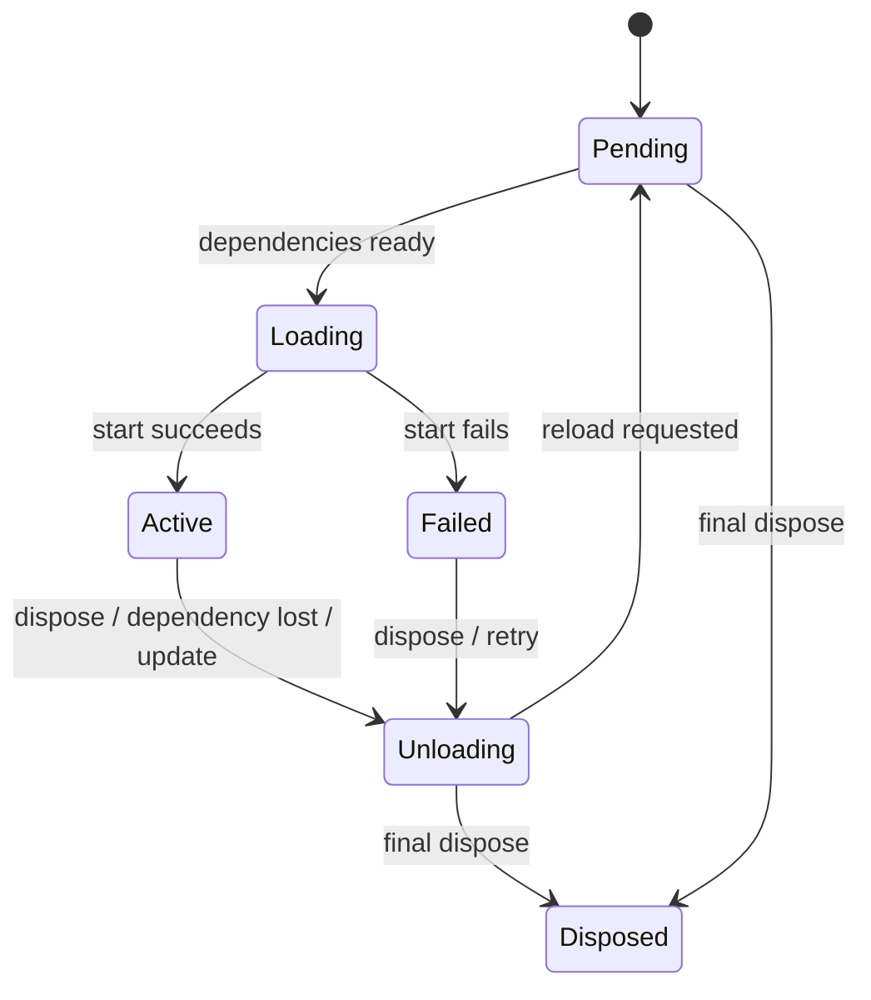

# Tessivum 目标运行时架构

> 本文定义目标结构和跨运行时不变量；工作顺序见[二阶段开发计划](DEVELOPMENT_PLAN.md)，原生 Agent Mode clean cutover 见 [Phase 5 计划](PHASE5_NATIVE_AGENT_MODES_PLAN.md)，插件迁移规则见[插件生态兼容方案](PLUGIN_COMPATIBILITY.md)。

## 1. 架构目标

目标是把 Cordis 的“Context + 可逆生命周期 + 服务依赖 + 事件组合”语义迁移到 Rust，同时明确区分可信核心、沙箱扩展、旧 npm 生态和浏览器 UI。

```mermaid
flowchart TB
  subgraph Host["Rust Host"]
    Loader[Profile / Loader]
    Core["Cordis Core\nContext · Scope · Fiber · Services · Events"]
    Native[Native Rust Plugins]
    Wasm[Extism/WASM Adapter]
    Bridge[Legacy Node Bridge Client]
    Api[HTTP / SSE / RPC]
    Loader --> Core
    Core --> Native
    Core --> Wasm
    Core --> Bridge
    Core --> Api
  end

  subgraph Node["Legacy Node Host"]
    JsCordis[@deepseek-ai/cordis]
    Npm[Existing npm Plugins]
    JsCordis --> Npm
  end

  subgraph Guest["WASM Guests"]
    Pdk[Cordis PDK]
    Plugins[WASM Plugins]
    Pdk --> Plugins
  end

  subgraph Browser["Browser"]
    ClientCordis[TypeScript Cordis]
    React[React / UI Plugins]
    ClientCordis --> React
  end

  Bridge <--> Node
  Wasm <--> Guest
  Api <--> Browser
```

### 1.1 仓库归属边界

运行时由两个独立仓库交付，依赖方向固定为 `tessivum → tessivum-core`：

| 能力 | 所属仓库 |
|---|---|
| Context、Scope、Fiber、Service、Event Bus | `tessivum-core` |
| 通用 Loader/Entry Tree、Native Plugin API | `tessivum-core` |
| Extism adapter、WASM ABI/PDK | `tessivum-core` |
| Legacy Node framed transport、generation cleanup | `tessivum-core` |
| Agent、Session、LLM、Tools 领域协议与实现 | `tessivum` |
| Harness profile/bundle、领域服务 bridge proxy | `tessivum` |
| CLI、Host/API、SDK、Web/Browser 集成 | `tessivum` |

Tessivum Core 不认识 Agent、Session 或 Tool。Tessivum 产品只通过核心框架公开接口和版本化协议集成，不能读取私有 Registry/Fiber 字段。通用 transport 与产品领域代理分离，避免核心框架反向依赖 Harness 产品。

### 1.2 产品级 Native Agent Mode

Standard、PTC、Minimal 和 Composition 是 `tessivum` 产品组合，不是 Core 概念。产品层的 `AgentModeSpec` 声明 Prompt、模型工具呈现、Session 可调用工具、Skills、Plan、Compaction 和 Native/WASM/Legacy 插件 Entry；创建或恢复 Session 时解析为不可变 `ResolvedMode`，再挂载到 Session 子 Context。

```text
Host shared services
├── LLM / Tool Runtime / Skills / Compaction
├── Native / WASM / Legacy PluginRuntime
└── Native Agent Mode Registry
    ├── Standard Session Scope
    ├── PTC Session Scope
    ├── Minimal Session Scope
    └── Composition Session Scope
```

Mode 只授予受限视图，不复制共享服务，也不能扩大 WASM manifest 权限或 Legacy Bridge 服务面。同一 Host 的 Session 可以选择不同 Mode，且 Prompt、工具目录、Compaction、Skill roots 和临时插件资源不得相互泄漏。

内置 Mode 由 Rust 静态规格定义；自定义 Mode 使用 `${data_dir}/modes/<id>/mode.toml`，并可由有序 CLI `--patch` 的 `agent-presets.default` 选择。Rust Agent Runtime 不执行上游 `agent.cordis.yml`，也不执行任意 Host/Client JavaScript。现有 npm/Cordis 包仍由 Legacy Node Host 加载，Browser `dsh.client` 仍由 Browser Cordis 加载；Mode 配置格式与插件 Runtime 是两条正交轴。

冻结源 Web 使用的 `agentPreset.*`/`agentPreset` 仅存在于 `api.rs` 的 Browser Wire adapter。内部 Session、Agent、Registry 和持久新写入统一使用 `ModeId`/`agentMode`；旧内置 ID 只在持久数据迁移边界转换。`dynamicCordisRunner/*` 仅保留不可执行的有界兼容响应，不是 Composition 或 Agent Mode 的运行时入口。完整契约、删除项和验收矩阵见 [Phase 5 计划](PHASE5_NATIVE_AGENT_MODES_PLAN.md)。

## 2. 术语

| 术语 | 含义 |
|---|---|
| Context | 插件访问服务、事件、配置和生命周期能力的作用域句柄 |
| Scope | 资源所有权与父子关系的实体 |
| Fiber | 一次插件挂载的运行时实例及状态机 |
| Service | 以稳定键暴露的能力实现 |
| Effect | 绑定到 Scope、卸载时必须撤销的资源注册 |
| Native Plugin | 与 Host 同进程的 Rust 插件 |
| WASM Plugin | 通过 Extism ABI 调用的 Guest |
| Legacy Plugin | 在 Node Compatibility Host 中运行的现有 npm/Cordis 插件 |
| Browser Plugin | 运行在页面 TypeScript Cordis 中的 React/UI 插件 |
| Handle | 跨边界引用 Host 资源的不可伪造标识，不是内存引用 |

## 3. Context 与 Scope 模型

### 3.1 结构

Context 是轻量句柄，实际状态由共享 Scope 节点持有：

```text
ContextHandle
└── Scope
    ├── id
    ├── parent
    ├── state
    ├── realm map
    ├── intercept chain
    ├── owned resources
    ├── child fibers
    └── visible service snapshot
```

Context 派生不得复制全局服务表。服务查找沿 Scope/realm 规则解析，并返回受生命周期约束的实现或 Handle。

### 3.2 不变量

1. 每个资源只有一个拥有 Scope。
2. 子 Scope 不延长已销毁父 Scope 的生命周期。
3. Context 可克隆不等于 Scope 永久存活；调用时必须检查状态。
4. 跨运行时只传递 Context ID/能力 Handle，不传递 Context 对象。
5. root 是管理入口，不是插件绕过依赖和权限的逃生口。

## 4. Fiber 生命周期

### 4.1 状态机



### 4.2 生命周期协议

插件启动是事务：

1. 创建 Fiber 和临时资源收集器；
2. 验证配置；
3. 检查 required services；
4. 执行插件 start；
5. 收集服务、监听器、子插件和 disposer；
6. 全部成功后发布 Active；
7. 失败则反向撤销全部临时资源并发布 Failed。

卸载：

1. 原子切换到 Unloading，拒绝新注册；
2. 停止接收新的事件/服务调用；
3. 取消拥有的操作；
4. dispose 子 Fiber；
5. 反向启动 disposer；
6. 等待全部异步 cleanup；
7. 移除服务和监听器；
8. 发布 Pending 或 Disposed。

`Drop` 不能执行异步静默，因此公开契约必须有显式 `dispose().await`。未显式 dispose 的 Drop 路径只负责触发取消、记录诊断和防止新工作。

## 5. Service Registry

### 5.1 Native 服务

Native 服务是 Rust 内部的 typed capability。实现由 Scope 拥有，消费者获得带代际检查的句柄；provider 被替换后旧句柄不能继续调用。

概念键：

```text
ServiceKey {
  name,
  contract_version,
  realm,
}
```

Rust 内部可使用泛型/trait 保证类型，公开诊断仍保留稳定字符串名。

### 5.2 跨运行时服务

WASM/Node 边界不能传 trait object。跨运行时服务必须有显式可序列化操作：

```text
service.call {
  service,
  contractVersion,
  method,
  input,
  contextHandle,
  cancellationId
}
```

返回：

```text
service.result {
  requestId,
  ok,
  output | error
}
```

一个服务只有在拥有稳定协议时才允许跨边界。否则 provider 和 consumer 必须留在同一运行时子图。

### 5.3 依赖门控

Fiber 的 required dependencies 构成激活条件：

- 全部满足：允许 Loading；
- 任一缺失：保持/回到 Pending；
- provider 替换：重新计算实现代际，必要时 reload；
- optional dependency：调用时显式查询，不影响 Fiber 激活。

依赖按服务可用性决定，不按配置行顺序决定。

## 6. Isolation 与 Intercept

### 6.1 Isolation

每个服务键可被映射到 realm label。子 Context 调用 `isolate(service)` 时获得新 label；只有匹配 label 的 provider/consumer 互相可见。

共享 label 允许多个子 Context 加入同一 realm。realm label 由 Host 生成，Guest 不能自行伪造。

### 6.2 Intercept

Intercept 是沿 Context 派生链组合的配置片段。组合顺序必须固定：

```text
root/base → ancestor intercepts → child intercepts → plugin config
```

跨运行时只传递解析后的配置或版本化配置表达式，不把 Rust 配置对象地址暴露给 Guest。

## 7. Effect 与资源所有权

所有会活过当前调用的注册必须产生 ResourceId：

```text
Resource {
  id,
  ownerScope,
  kind,
  generation,
  dispose,
}
```

资源种类至少包括：

- event listener；
- service provider；
- child fiber；
- timer/task；
- stream/subscription；
- WASM instance registration；
- Node Bridge registration；
- application-defined disposer。

手动 dispose 和 owner dispose 使用同一状态机，确保幂等。跨运行时连接断开时按 owner generation 批量回收。

## 8. Event Bus

### 8.1 分发模式

| 模式 | 行为 |
|---|---|
| emit | 按注册顺序同步观察，不返回值 |
| parallel | 并发调用全部 listener，等待并聚合错误 |
| serial | 按顺序等待，首个非空/非 false 结果终止 |
| bail | 同步按顺序，首个有效结果终止 |
| waterfall | listener 接收 `next`，可包装或阻断下游 |

事件名和 payload schema 属于公开契约。跨运行时事件必须声明允许的分发模式和序列化 schema。

### 8.2 Waterfall 跨进程规则

跨进程 waterfall 使用 continuation/correlation id，而非传函数：

```text
Host -> listener.invoke(event, payload, continuationId)
Node/WASM -> listener.next(continuationId, updatedPayload)
Node/WASM -> listener.return(continuationId, result)
```

约束：

- continuation 一次性；
- 有截止时间和取消；
- 同一插件实例内串行处理；
- 禁止等待一个最终会回到当前实例的循环调用；
- 断线等价于 listener 失败，不得永久阻塞事件链。

## 9. Plugin Runtime 抽象

统一管理面只表达生命周期，不强迫三种运行时使用同一种内部实现：

```text
PluginRuntime
├── inspect(descriptor)
├── instantiate(context, config)
├── update(instance, config)
├── dispose(instance)
└── snapshot(instance)
```

运行时选择：

| runtime | 实现 |
|---|---|
| native | Rust 静态注册表/受控动态库策略 |
| wasm | Extism adapter |
| legacy-node | Node Bridge |
| browser | 不由 Host PluginRuntime 实例化，只通过 Web manifest 发布 |

## 10. WASM ABI

### 10.1 Guest 入口

第一版标准入口：

```text
cordis_init
cordis_call
cordis_event
cordis_update
cordis_stop
```

复杂输入输出使用统一 JSON envelope：

```json
{
  "abi": "cordis.plugin/v1",
  "requestId": "req-...",
  "context": "ctx-...",
  "payload": {}
}
```

所有 envelope 必须有大小上限；错误使用稳定 code、message 和可选 details，不依赖 Guest stack 作为机器判断。

### 10.2 Host Functions

按 capability 分组，不暴露通用“任意 Host 调用”：

```text
cordis.log
cordis.service.call
cordis.event.emit
cordis.event.subscribe
cordis.registration.dispose
cordis.config.get
cordis.kv.get/set
tools.register
http.request
fs.read/write
clock.now
random.fill
```

每次调用校验：插件实例、Scope 代际、权限、输入 schema、大小和并发额度。

### 10.3 执行模型

- 默认单实例调用串行化；
- 长任务接受 cancellation id；
- Guest 不拥有后台事件循环；后台工作由 Host task/timer capability 持有；
- Host 调用 Guest 时必须设置 fuel/epoch/timeout 或 Extism 提供的等价限制；
- 卸载先拒绝新调用，再取消在途调用，最后 drop 实例。

## 11. Legacy Node Bridge

### 11.1 进程模型

默认每 profile 一个 Node Host；真实部署需要不同信任域时再拆分。每插件一个 Node 进程会浪费内存且破坏共享 npm/Cordis 服务语义，因此不是默认方案。

### 11.2 协议

传输使用长度前缀 frame，避免换行 JSON 被日志或大 payload 破坏。消息至少包含：

```text
protocolVersion
connectionGeneration
requestId
pluginInstanceId
contextId
method
payload
```

请求必须支持：响应、错误、取消、超时和 backpressure。日志走独立 frame 类型，不能混入 RPC stdout。

### 11.3 崩溃与恢复

Node Host 断开时：

1. 标记 generation 失效；
2. 拒绝所有旧 Handle；
3. 结束在途请求；
4. 删除该 generation 拥有的服务、监听器和资源；
5. 将依赖这些服务的 Native Fiber 转为 Pending；
6. 按部署策略决定是否重启 Node Host；
7. 重启后由 Loader 重建插件树，不复用旧 Handle。

### 11.4 信任边界

Legacy Node Host 运行的是可信 npm 代码。进程隔离降低故障扩散，但不是权限沙箱；文件、网络和子进程权限必须由 OS/容器/Harness sandbox 决定。

## 12. Loader 与配置

Loader 负责把声明式 Entry Tree 映射到 PluginRuntime：

```text
Entry {
  id,
  package/module,
  runtime,
  config,
  inject,
  isolate,
  intercept,
  disabled,
  children
}
```

更新流程：

1. 解析到 detached candidate；
2. 校验 id、runtime、依赖和配置；
3. 计算 diff；
4. 启动候选新增/替换项；
5. 等待候选稳定；
6. 原子提交；
7. 再卸载删除项；
8. 任何失败按反向操作恢复最后可运行树。

配置表达式只允许显式、可审计的变量和服务读取。旧 `!!js` 需要完整 JavaScript 时，整棵相关子树交给 Legacy Node Loader，而不是在 Rust Host 中 eval。

## 13. Browser 平面

浏览器 TypeScript Cordis 已确认为长期兼容边界，Rust Host 不在浏览器内重建 Context：

```text
Rust Host
  ├── 扫描 dsh.client 并产生 window.__DSH_BOOT__
  ├── 提供 HTTP/durable SSE 与 published WebSocket downlinks
  └── 持有 Session、workspace 与事件的 durable truth

Browser Cordis
  ├── connection/remotes 与 client runtime
  ├── React slots/UI plugins
  └── dynamic client half 与页面生命周期
```

Browser 兼容构建直接使用上游 `apps/web/src/main.ts` 的薄入口、`@deepseek-ai/dsh-client-web` 源码和当前 profile 中所有 `dsh.client` 双面包；`web/` 只保存构建适配与有界品牌 Overlay，不维护自有 bootloader、模块系统或 UI fork。Host 从 Loader entries 动态生成 package-name graph，提供同源 bundle 路由和内容 hash 校验；精确 wire 与完成门槛见 [`COMPATIBILITY_BASELINE.md`](COMPATIBILITY_BASELINE.md)，品牌 Overlay 边界见 [`PHASE4_BRAND_DISTRIBUTION_MARKET_PLAN.md`](PHASE4_BRAND_DISTRIBUTION_MARKET_PLAN.md)。

浏览器不直接访问 Rust Context。API 只允许 loopback 监听，WebSocket 校验同源 `Origin`；所有权限和持久事实由 Host 判定。重连通过 `HostApi::list_sessions`、workspace baseline 和 durable SessionEvent 恢复，不把浏览器本地状态当作事实源。

## 14. 并发、取消与背压

- Native task 使用 Tokio；每个长期操作必须有 owner Scope 和取消 token。
- Fiber 状态更新串行化；服务通知可以批处理，但提交顺序必须确定。
- WASM 单实例默认串行调用；需要吞吐时使用实例池，但实例状态不得无意共享。
- Node Bridge 设置全局和每插件在途上限；超过上限返回明确 overload 错误。
- 流式通道使用有界队列；慢消费者触发背压、截断或取消，策略由具体协议声明。
- 取消是状态转换，不是忽略 Promise；完成与取消竞争时必须规定 first-wins。

## 15. 错误模型

统一错误 envelope：

```text
CordisError {
  code,
  message,
  phase,
  pluginId?,
  fiberId?,
  retryable,
  details?,
  sourceChain?
}
```

稳定 code 供程序判断，message 面向人。Guest/Node stack 只作为诊断 details，不参与控制流。多个 cleanup 失败使用聚合错误，但仍继续清理其余资源。

## 16. 可观测性

必须可查询：

- Context/Scope 树；
- Fiber 状态与等待的服务；
- 服务 provider、realm 和 generation；
- effect/resource 树；
- WASM 实例与权限；
- Node Bridge generation、队列和在途请求；
- Loader 当前树与最后失败候选；
- 事件 listener 数与慢调用。

诊断 API 默认不返回插件源码、秘密或任意服务对象。

## 17. 安全矩阵

| 平面 | 默认信任 | 能力控制 |
|---|---|---|
| Native Rust | 可信 | 编译/发布审核、Harness policy |
| Extism/WASM | 非可信或半可信 | 通用 Capability 与 manifest `servicePermissions` 双层授权；未知、缺失、过期或通配声明默认拒绝；WASI 禁用并限制 memory/fuel/timeout/I/O |
| Legacy Node | 可信旧代码 | 独立进程、OS sandbox、Bridge 输入限制 |
| Browser | 非可信客户端 | exact bound loopback Host/Origin authority、RPC schema、approval generation/rpcId、redacted settings、write-only credentials、服务端状态权威 |

## 18. 架构验收不变量

1. 卸载完成后没有该 Scope 拥有的资源。
2. required service 缺失时插件不会部分运行。
3. provider 消失后旧跨运行时 Handle 无法继续调用。
4. Node/WASM 崩溃不会污染 Native Registry。
5. 配置失败保留最后可运行树。
6. 持久事实只由 Host 写入并可重放。
7. 非可信 WASM Host service call 必须同时通过通用 Capability 和精确 `service@version`/method 策略；卸载后旧实例与 policy 均失效。
8. 现有浏览器插件不因 Host Rust 化而被迫重写。
9. Browser approval 必须先持久化 asked、first-wins 回答、再持久化 decided 并发送 resolved；刷新复用同一 rpcId。
10. Browser 永不读取 credential value 或 settings secret；DNS rebinding 不能绕过 exact Host/Origin authority。
11. Workspace ID 由 Host 签发；Session/Tool/Subagent 仅通过 generation-checked lease 使用 canonical root，Browser path 只允许 workspace.create。
12. Registry 0600、bounded single-open、exclusive profile lock、atomic replace；删除 workspace 先撤销 live Agent，再失效 lease。
13. Agent Mode 属于 `tessivum` 产品层，`tessivum-core` 不出现 Standard/PTC/Minimal/Composition 领域类型。
14. Session 的 `ResolvedMode` 是 Prompt、工具视图、Skills、Plan、Compaction 和模式插件 Entry 的唯一权威；Host 级环境变量不得切换全部 Session 的模式。
15. PTC 的 nested dispatcher 只能调用当前 Session 允许的工具；Minimal persistent shell 和 Composition Entry 全部归当前 Session Scope。
16. `mode.toml` 只能引用已知 capability/Runtime/插件且不能扩大插件权限；未知或缺失项在 Agent 启动前失败。
17. 删除 `agent.cordis.yml` Runtime Parser 不改变 Legacy Node、Extism/WASM 或 Browser Cordis 的独立兼容边界。
