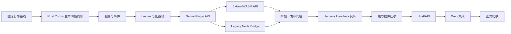

# Tessivum 二阶段开发计划

> 状态：两阶段迁移、Phase 5 原生 Agent Mode clean cutover、Phase 6 DSH Profile 兼容、Phase 7 第一方市场、Phase 8 Remote Access、Phase 9 性能证据与社区插件验证已完成；Phase 10 实施中，10-B Windows 运行时与 ACL sandbox 已实现、原生安全验收进行中，安装与发行尚未完成
> 计划校准日期：2026-09-10
> Tessivum 实现基线：`v0.1.0-alpha.27`（已发布；四平台归档下载校验与 macOS 安装升级验收通过）
> 上游兼容基线：DeepSeek Harness `0.1.0-rc.5` / `47f943859bef60e4160492346772ded9b24f765a`
> 适用范围：Rust Cordis 内核、Tessivum Host/Agent Runtime、原生 Agent Mode、插件生态兼容、第一方市场、Remote Access、Web 模型配置面、性能证据、社区插件验证与 Windows 原生发行
> 当前版本：`v0.1.0-alpha.27`，包含按持久文件修订失效的 `session.list` 导航摘要缓存，以及明确不支持图片与图片能力未知的区分；四平台发行、源码 CI、归档校验、安装升级及市场包验证已完成。支持范围仍为 macOS/Linux x86_64 与 ARM64；远程侧边栏终端及 Windows 原生发行仍不支持。

## 1. 文档集

本计划负责工作顺序、交付物和验收门槛。具体设计见：

- [目标运行时架构](ARCHITECTURE.md)：Context、生命周期、事件、Native/WASM/Legacy Node 三运行时和浏览器边界。
- [插件生态兼容方案](PLUGIN_COMPATIBILITY.md)：现有 npm 插件兼容级别、Legacy Node Bridge、WASM ABI 和迁移路径。
- [Phase 3 产品能力开发计划](PHASE3_PRODUCT_PLAN.md)：已完成的 Alpha.2 WASM 权限、Alpha.3 Browser 控制面与 Alpha.4 多工作区实施记录。
- [Phase 4 品牌、分发与社区市场开发计划](PHASE4_BRAND_DISTRIBUTION_MARKET_PLAN.md)：已完成 Alpha.10 独立品牌/可安装分发与 Alpha.11 `dshmarket@1.29.2` 兼容实施。
- [Phase 5 原生 Agent Mode 与插件组合开发计划](PHASE5_NATIVE_AGENT_MODES_PLAN.md)：已完成 Native Mode、`mode.toml`、Session 级能力隔离和 `agent.cordis.yml` clean cutover。
- [Phase 6 DSH Profile 兼容与 `tsv` 命令开发计划](PHASE6_DSH_PROFILE_COMPATIBILITY_PLAN.md)：已完成 `dsh.profile.bundles` 权威语义、市场状态闭环、统一插件 mutation 与发行命令别名。
- [Phase 7 第一方插件市场与 Host 重启开发计划](PHASE7_FIRST_PARTY_MARKET_PLAN.md)：已完成 Tessivum-owned 市场、确定性更新、新版本等待、旧市场迁移与 Host-owned 重启。
- [Phase 8 Remote Access 与新版 Legacy Host 兼容开发计划](PHASE8_REMOTE_ACCESS_COMPATIBILITY_PLAN.md)：通用 Node Host facade、Rust-owned Remote Access、自有最小配对/设备界面及发行门槛已完成。
- [Phase 9 性能证据与社区插件发布计划](PHASE9_BENCHMARK_ECOSYSTEM_PLAN.md)：固定 Linux 30 样本 Core/产品公开结果、中英文报告、README 可追溯数字及 `dsh-better-sidebar@0.16.1` 社区验证闭环均已完成。
- [Phase 10 Windows 原生发行开发计划](PHASE10_WINDOWS_NATIVE_RELEASE_PLAN.md)：Windows x86-64 MSVC、PowerShell、ACL sandbox、Job Object、ZIP、`install.ps1` 和真实 Browser/插件发行门槛。
- [`reference.md`](../../reference.md)：最初的技术方向与选型讨论，仅作背景，不覆盖本计划中的源码分析结论。

如实现与本文冲突，先更新本文和关联架构文档，再修改代码；不能让代码和实施指引长期分叉。

> 本文后半保留 Alpha.2–Alpha.6 的产品实施记录；其中“已完成”只描述 Tessivum 自有 Alpha 路径，不代表 DeepSeek Harness 外部契约兼容完成。当前冻结契约、真实缺口和唯一完成定义以 [`COMPATIBILITY_BASELINE.md`](COMPATIBILITY_BASELINE.md) 为准。

## 2. 目标与边界

### 2.1 总目标

分两个阶段完成：

1. 建立可独立发布的 Rust Cordis 项目，重现 DeepSeek Harness 实际依赖的 Context、服务依赖、生命周期、事件和 Loader 语义，并提供 Native Rust、Extism/WASM、Legacy Node 三种插件运行方式。
2. 基于 Rust Cordis 迁移 DeepSeek Harness 的 Host 与 Agent Runtime；先完成 Headless 纵向闭环，再迁移能力插件、Host/API 和 Web 集成。

最终系统的运行时分工：

```text
Native Rust       核心、高频、可信插件
Extism/WASM       新的跨语言或非可信扩展
Legacy Node Host  现有 npm/Cordis 插件
TypeScript Web    现有 React/浏览器插件
```

### 2.2 明确不做

- 不逐行翻译 TypeScript，也不在 Rust 中仿造 JavaScript Proxy、原型链或声明合并。
- 不把 Harness 核心服务全部放进 WASM。
- 不声称 Extism 可以原样运行现有 npm/Cordis 插件。
- 不在第一轮迁移中重写 React UI。
- 不以未经测量的“单 Agent 2 MB”或“数万 Agent”作为验收承诺。
- 不保留无期限的双实现；每个迁移单元达到替换门槛后删除对应的新旧胶水之一。

## 3. 源码基线与事实来源

已下载的只读上游源码：

| 项目 | 本地路径 | 固定提交 |
|---|---|---|
| Cordis | `upstream/cordis` | `8cc9e33fab69e2d0476d126baaf2acb24e6a6ab4` |
| DeepSeek Harness | `upstream/deepseek-harness` | `47f943859bef60e4160492346772ded9b24f765a` |

Rust Cordis 的行为基线不是单独的最新上游 Cordis，而是：

1. Harness vendored Cordis 基线 `56b3d4f725681cf4556c1a8695a709cc3b6eed74`；
2. [`vendor/README.md`](../../upstream/deepseek-harness/vendor/README.md) 记录的 Harness 本地修改；
3. 当前 Cordis 上游已经吸收的后续修复。

发生冲突时优先级：

```text
Harness 当前可观察行为
  > Harness vendored 补丁契约
  > 当前 Cordis 上游行为
  > 历史实现细节
```

上游源码只作为分析和差分基线，不直接复制进新项目的运行目录。

## 仓库与版本管理

独立品牌统一命名为 **Tessivum**，由 *tessera*（可组合单元）与 *aevum*（时间/生命周期）构成。主产品、CLI 与 Harness 仓库使用 `tessivum`；独立框架仓库和核心 crate 使用 `tessivum-core`。

Cordis 与 Harness 使用两个独立 Git 仓库，从第一天保持单向依赖：

```text
tessivum-core                独立框架仓库
    ↑ tagged crate / release
tessivum                     Harness 产品仓库与 CLI
```

建议本地为同级目录，而不是嵌套仓库、Git submodule 或 subtree：

```text
SCHarness/                    # 本地总工作区，不是项目仓库
├── upstream/                 # 只读参考源码
├── reference.md
├── tessivum-core/            # 独立 Git 仓库
└── tessivum/                 # 独立 Git 仓库
```

仓库职责：

| `tessivum-core` | `tessivum` |
|---|---|
| Context、Scope、Fiber、Service、Events | Agent、Session、LLM、Tools 等领域服务 |
| 通用 Loader/Entry Tree 与事务生命周期 | profile/bundle 产品组合和默认配置 |
| Native Plugin API、WASM ABI、PDK | Harness Native 插件与 WASM 能力协议 |
| 通用 Legacy Node transport/runtime | tools/agents/sessions 等 Harness 服务代理 |
| Cordis 行为夹具、ABI 与 bridge 协议 | Headless、CLI、Host/API、Web 与端到端测试 |

依赖规则：

1. Harness 可以依赖已发布或已打 tag 的 Cordis；Cordis 不得导入 Harness crate、类型或协议。
2. 通用插件 ABI、生命周期和 bridge transport 归 Cordis；领域服务 wire（如 `tools@1`、`agents@1`）归 Harness。
3. 正常构建固定 Cordis 版本并提交 `Cargo.lock`。本地联调可使用不提交的 Cargo path/patch override，禁止把开发机绝对路径写进 manifest。
4. Cordis release candidate 必须触发 Harness 对固定集成场景的兼容检查；通过后才能发布 Cordis stable/tag。
5. 不创建第三个“shared”仓库。真正通用的契约放 Cordis，产品契约放 Harness；跨仓库夹具由 Cordis 版本化发布供 Harness 测试消费。
6. 两仓库 `main` 始终可构建；使用短期 feature branch，不建立长期 `phase-1`/`phase-2` 分叉。

Issue 归属：最小 Cordis fixture 可复现的问题归 `tessivum-core`；Agent/Session/工具等产品行为归 `tessivum`；bridge transport 问题归核心仓库，具体 Harness 服务代理问题归产品仓库。

`SCHarness/` 仅作为本地总工作区；`upstream/` 与 `reference.md` 只供研究，不进入产品发布物。`tessivum-core/` 是阶段一独立框架仓库，`tessivum/` 是阶段二产品仓库并持有本路线图。核心框架专属公开接口文档归 `tessivum-core`；本文链接核心框架的固定 release/tag 文档，避免复制两份可漂移的规范。

## 4. 总体交付顺序



阶段二不得在阶段一接口仍频繁破坏时开始大规模迁移。允许用一个最小 Headless 探针提前验证接口，但该探针不能变成第二套临时框架。

### 4.1 Alpha.26 产品优化与追加修复（已发布记录）

本节以已发布的 `v0.1.0-alpha.25` 为实现基线，记录 Alpha.26 原四项优化与后续两项用户报告修复的实施和验收。本文是本轮范围与验收的唯一计划入口，不另建重复优化清单；Phase 10 Windows 原生发行继续按独立计划推进，不因本轮规划而标记完成。

本轮采用 Tessivum 自有产品默认值，不继续复制 DeepSeek 的首次配置与默认模型体验。这是对上游产品行为的有意差异，不放宽文件沙箱、凭据保护、附件校验或持久会话契约。后文 Alpha.6 等历史章节保留原实施记录；本轮涉及的默认选择规则以本节为准，对应 Alpha.26 发行行为，不回写 Alpha.25 发布事实。

#### 4.1.1 文件工具路径与符号链接遍历修复

- [x] 完成统一路径入口和安全遍历修复，通过真实工作区场景与越界回归。

已确认问题：Read 收到工作区内绝对路径仍被 `Filesystem::target` 拒绝，而工具描述未明确相对路径要求；合法的 Glob `path: "."` 也出现越界错误。隔离实验确认 `lstat` 在判断链接类型前调用了会解析最终链接的路径检查，外向符号链接可中断目录遍历；原会话未记录具体触发链接，不将其猜测为某个固定目录。

实施范围：

- Read、Write、Edit、Read Image、Glob、Grep 共用路径解析规则：接受工作区相对路径和经验证位于工作区内的绝对路径，再交给严格的底层 capability；创建新文件时验证已有父目录，拒绝真正的越界访问和链接逃逸。
- 修正 `lstat` 的不跟随最终符号链接语义，验证父目录的真实归属；Glob/Grep 按既定规则跳过链接，不因一个外向链接中断整个搜索，不笼统吞掉权限或 I/O 错误。
- 工具 schema/描述与运行时上下文同步说明路径规则；错误区分路径格式、不存在和越界，并给出调用者有权获知的定位信息。
- 主要修改面：`src/filesystem.rs`、`src/builtin_tools/model_tools.rs` 及工作区资源解析边界；保持跨平台路径语义和 session workspace lease 校验。

验收：同一工作区文件使用相对/绝对路径均成功；根目录含外向或悬空链接时可正常搜索其他文件；显式读取/写入工作区外目标仍被拒绝；写入新文件、父目录链接及工作区切换不绕过原授权。保留能暴露原缺陷的最小回归，并从实际 CLI/Web 工具入口验证。

#### 4.1.2 原生运行时上下文身份与准确文案

- [x] 完成 Tessivum-owned 上下文身份切换，验证注入、去重和历史会话恢复。

已确认问题：运行时快照由我们的 Rust `permissions.rs` 与 `agent_loop.rs` 生成，系统提示组装也已有原生 `system_prompt.rs`；当前文案仍写 `Current DSH file policy`，消息来源仍标为 `@deepseek-ai/dsh-system-prompt`，不代表这段快照仍由上游插件执行。

实施范围：

- 产品文案统一使用完整名称 Tessivum；`tsv` 保留为 CLI 别名。原生快照来源使用 `tessivum/runtime-context`，UI 展示和去重判定同步切换，不为改名新建 npm/WASM 插件。
- 工作区、文件访问能力、审批策略、时区从实际运行状态派生；路径说明以 4.1.1 完成后的真实能力为准，不仅替换品牌名而保留不准确权限承诺。
- 恢复旧会话时按需生成新来源的当前快照，不改写历史事件中的原始来源；保留真实第三方包名、许可证和上游来源声明。

验收：新会话显示 Tessivum 原生来源；相同状态不重复注入、策略变化生成新快照；旧会话恢复后得到正确当前上下文，历史日志不被重写；权限描述与实际文件操作结果一致。更新受影响的消费逻辑与行为验证，不只修改 UI 文本。

#### 4.1.3 厂商中立启动与显式模型选择

- [x] 完成无 Key 可进入工作台、无隐式 DeepSeek 默认模型的完整配置链路。

已确认问题：前端首次引导以 DeepSeek Key 为中心，后端还会自动注册 DeepSeek 路由并回退选取模型；只隐藏引导弹窗不能消除默认倾向。当前有效 `SessionModelSelection` 要求非空 provider/model，不能靠空字符串或假模型表示未配置。

实施范围：

- 首次启动直接进入工作台，可管理工作区、查看历史和准备图文草稿；不主动弹 Key 表单。模型入口显示“选择模型”，发送前再要求完成必要配置。
- 恢复会话沿用会话保存的模型，新会话仅沿用用户明确保存的默认模型，否则保持未选择；不硬编码厂商、不按目录顺序偷偷选模型，保留老用户配置，已失效选择明确提示修复而非静默替换。
- 允许尚无模型的工作台/会话存在，但运行 Agent 和发送请求必须有有效、可路由的选择。前端、Host 会话创建、模型目录、默认配置和发送 admission 一起修改。
- DeepSeek 作为普通可选服务商；复用现有 Models/Settings/Credentials，云端鉴权按服务要求执行，显式无鉴权的本地端点不要求虚构 Key。同步核对 CLI 入口的鉴权约束，不将 Web 已支持无 Key 路由误写成全部入口已经支持。

验收：全新数据目录且无任何 Key 时可进入并编辑草稿；无模型时不发出 LLM 请求，配置后同一草稿可发送；云端缺失 Key 与无鉴权本地服务各按真实规则处理；重启、旧会话恢复及新会话默认选择均符合上述优先级。

#### 4.1.4 默认图片输入与模型能力适配

- [x] 完成默认图片草稿入口、能力提示和真实多模态发送闭环。

已确认基础：已有粘贴/拖放、附件预览、持久化及 Responses/Chat-compatible/Anthropic Messages 图片编码；Responses 图片传输聚焦回归已通过。DeepSeek 路由和部分默认模型元数据声明为纯文本，因此接入适配器不等于图片能力已开启，本项不是从零开发图片插件。

实施范围：

- 无模型、无 Key 或当前模型为纯文本时仍可将图片加入草稿，保留格式、字节、数量和像素限制；提供可发现的图片选择入口，复用现有粘贴/拖放与附件能力。
- 发送前检查当前模型：支持图片则正常发送；纯文本则提示切换且保留草稿；未知自定义模型提示显式配置能力。补齐有依据的模型能力声明，不按名称猜测，不将所有兼容端点视为多模态。
- 保留 Host 与 adapter 的最终模态、附件及授权校验，防止旧 UI 状态或其他入口绕过；检查当前待发送上下文、排队消息及有效历史中的图片与模型切换兼容性，不能切换后才失败或悄悄丢图。
- 不默认启用 OCR、额外视觉模型或跨服务转发；纯文本主模型调用独立视觉服务属于后续显式配置功能，需说明图片接收方与费用，不纳入本轮默认行为。

验收：图片选择/粘贴/拖入与预览可用；未配置或拒绝发送时图文草稿不丢失；支持图片的已配置端点完成实际图文请求，相关协议使用正确格式；持久会话重启后图片可恢复；纯文本或能力未知模型、超限/损坏附件和不兼容模型切换在正确边界被阻止，不隐式转发。

#### 4.1.5 集成与发布门槛

版本准备前的源码验收记录：实现复用固定上游客户端补丁 `web/patches/deepseek-harness.patch`、原生服务和共享配置，没有第二套前端或并行状态来源。当时已同步契约文档、行为回归与 `CHANGELOG.md` 源码变更记录；Cargo 版本、安装下载链接和 Alpha.25 发布产物保持不变，Alpha.26 尚未打标签或发布二进制。Windows 原生发行不在本次验收结论内。

版本准备前的追加发布决定：第 4.1.6、4.1.7 节源码修复与本地验收已完成；用户确认远程终端暂不支持，第 4.1.8 节按本地终端与已授权远程历史恢复的范围完成验收。远程终端不再阻断本版，但不能宣称已支持；当时版本、标签和发行产物操作尚未执行。下列既有测试结果仅证明原四项优化，追加修复证据单独记录于第 4.1.8 节。

2026-09-09 原四项优化的本机验收证据（不代表追加修复已完成）：

- `cargo fmt --all`、严格 Clippy、`cargo test --all-targets`：564 项通过。
- Web source audit、客户端构建与 TypeScript 检查通过；source-client 240 个文件、3179 项通过。
- 四个真实 Chromium 场景通过：中立首屏与显式 DeepSeek 配置、已有提供商不隐式选模、默认模型与旧选择、图片选择/粘贴/拖放及同一草稿切模发送。随后图片场景再次覆盖成功发送清除旧拒绝提示。
- 实际 Web/API native-tool replay：9 次工作区内操作成功，2 次越界读写拒绝，外部文件未修改；含绝对/相对读取、绝对写入与编辑、相对/绝对 Glob、Grep、Read Image，根目录含外向和悬空链接。独立 headless CLI 仅验证其实际提供的 Read；六类工具完整验收来自 Host/API，不宣称 headless 暴露全部工具。
- 本地显式无鉴权 Responses 服务收到图文请求并返回 `ALPHA26_IMAGE_WIRE_OK`；Browser 观察到图片历史与 `tessivum/runtime-context`。此为本地协议验收，不是新增云厂商实测或性能测量。
- 发布事实与兼容清单检查通过；`check_compat_baseline.py` 使用 `TESSIVUM_CORE_SOURCE` 指向 Cargo 下载的固定 `86c7e1c` checkout，不修改正在开发的独立 Core 工作区。测试服务、浏览器标签与临时回放目录已清理。

#### 4.1.6 追加修复：刷新后的会话列表与历史恢复

- [x] 修复超限列表传输和刷新恢复链路，保留全部历史入口，通过大会话量与重连验收。

已确认事实：用户报告刷新后聊天记录和历史不再显示。对运行服务的只读查询中，`session.list` 返回 `response frame exceeds the configured limit`；最近两个会话的 `session.history` 分别成功返回 1423、2858 条事件，对应 JSONL 文件及工作区关联仍在。这证明这两个会话的数据仍可读取，不将界面空白直接等同于数据删除，也不据此保证未检查的全部会话完整。

修复前定位：`src/api.rs` 的 `compat_sync_sessions()` 读取全部会话历史并附加派生投影，`session.list` 一次返回完整列表；该响应和 `compat_ws_message()` 出站帧均采用 64 KiB 上限。修复后列表使用稳定排序、snapshot 游标及完整响应字节预算，只携带导航摘要与标题；客户端完成全部分页后原子应用，并保留失败时的选择与重试入口。详细投影仍从历史/订阅恢复。

实施范围与不变量：

- 列表采用稳定排序、游标和有界分页，约束条数及实际序列化字节数；定义单条过大、游标失效和并发修改的明确行为，不返回伪成功或无进展的分页。
- 列表只携带导航、展示必需的摘要；详细会话投影按需加载。迁移依赖原投影的消费者，不通过丢字段、隐藏旧会话或子会话缩小响应，也不以新数据库或缓存作为本轮前置条件。
- 同步 Host RPC、客户端类型与校验 schema、分页消费和重连处理；分批获得一致基线后再应用后续变更，旧连接或旧请求的结果不得覆盖新状态。明确基线版本与增量衔接，避免分页期间的新增、删除导致重复或遗漏。
- WebSocket 不再发送随会话数量无限增长的全量单帧；复用既有同步路径提供有界基线或失效通知与重拉。区分入站请求限制与出站数据预算，保留限流、背压和授权边界，不靠全局放大 64 KiB 上限掩盖问题。
- UI 区分加载中、加载失败与真实空列表；失败保留可恢复的选中会话 ID，显示错误与重试，不静默清空选择或创建替代空白会话。
- 不删除、截断或改写用户 JSONL，不清理数据目录作为修复手段；以隔离 fixture 或只读数据副本验证，不向用户真实会话注入测试消息。

验收：列表总量明显超过 64 KiB 时仍可分页访问全部预期会话，刷新与 Host 重启后恢复所选会话、历史消息和图片；覆盖长标题/大投影、边界页、分页中新增/删除/更新及断线重连，不重、不漏、不让旧响应覆盖新状态。列表失败显示可操作错误而非空历史。保留原超限失败的回归，并从实际 Browser/API 入口证明修复。

已执行：701 个持久化会话的 Browser 回归通过，分页恢复旧会话并重新显示已上传图片；另一隔离 Host 开启修复侧边栏，360 个保留会话与 1 个新会话分三页返回（完整响应 65,497、65,314、30,452 bytes）。本地刷新和 Host 冷启动恢复 `alpha26-history-0000`、历史文本及可解码的持久化 PNG；真实已授权 Cloudflare Browser 同样读全 361 个会话并恢复所选历史。测试只使用隔离 fixture，未向用户真实历史注入消息。

#### 4.1.7 追加修复：侧边栏 PTY 关闭与重连竞态

- [x] 修复终端 handle 与连接归属，防止失效 PTY resize/write 及旧连接误清理新终端。

已确认事实：用户安装的 `dsh-better-sidebar@0.17.1` 在 `lib/index.js:4506` 的 WebSocket message 回调调用 `handle.pty.resize()`，经 `node-pty@1.1.0/lib/unixTerminal.js:253` 报 `ioctl(2) failed, EBADF`。该调用使用了无效文件描述符。Cloudflare 的 Remote Access 地址行是入口提示，不是本异常的证据；目前不将 PTY 错误与历史列表失败认定为同一根因。

已复现的源码风险：旧 `PtyManager.close()` 在底层 kill 后才依赖异步退出更新状态；旧 socket/timer 按 key 清理，可能影响替代终端。受控回归在原版出现 `cancelled stale timer must be inert` 失败；修复后同步失效并校验 handle、socket、timer 归属，在实际消息回调边界处理操作错误。

实施范围与不变量：

- 销毁底层 PTY 前同步标记 handle 关闭，确保 close 幂等，关闭后不再执行 resize/write；不能只依赖异步退出事件。
- 消息处理、延迟销毁与退出回调校验 handle 身份及连接归属；旧 socket 的 close、旧 timer 或旧进程回调不得销毁、修改新 handle。保持现有终端复用、park、重连宽限期与配额语义。
- 在实际 resize/write 回调边界处理失效终端：结束失效连接并提供重新连接路径，释放监听器与定时器；其余错误保留结构化诊断，不以统一吞异常或无条件自动重建掩盖故障、丢失运行中命令。
- 变更进入可重建的插件源码与固定版本/补丁交付链路，更新适用的安装和兼容验证说明；不得仅修改用户 `~/.tessivum/plugins/node_modules` 后宣称产品已修复，也不未经验证泛化到其他插件版本。

验收：覆盖进程退出与 resize 同时发生、显式关闭后迟到的 write/resize、刷新快速重连、旧 socket 延迟关闭、宽限期到期和同 key handle 替换；无未处理 EBADF、无旧回调误杀新终端，监听器/定时器/进程不泄漏。先以确定性生命周期回归锁住竞态，再通过实际 node-pty、Browser 和已安装插件版本的等价场景验收。

交付：`packaging/patches/dsh-better-sidebar-0.17.1.patch` 与 `src/plugin_manager.rs` 的 profile-local 校验副本加载；原 npm 文件不原地修改，输入与输出 SHA-256 不符均拒绝。确定性生命周期回归、真实 `node-pty@1.1.0` shell 输出/退出及本地 Browser 快速刷新复用终端已验证。具体版本、校验和与可运行命令见 `PLUGIN_COMPATIBILITY.md` §6.6，不把旧 0.16.1 的市场验证记录冒充本次证据。

#### 4.1.8 追加修复的集成与发布顺序

- [x] 两项修复在确认范围内联合验收并完成 Alpha.26 发布与四个 macOS/Linux 归档下载校验；远程终端经用户确认暂不支持。

验收范围：本地开启 `dsh-better-sidebar@0.17.1` 的固定修复版本，联合检查刷新、终端重连和历史恢复；已授权远程入口检查历史分页、选择恢复和既有授权边界。2026-09-09 用户确认沿用 Phase 8 §4.2 的 loopback-only 策略，暂不支持远程侧边栏终端；此前要求的远程终端联合验收移出 Alpha.26 范围，不以本地结果冒充远程终端通过。

版本准备前门槛记录：新增行为回归失败于修复前、通过于修复后；严格 Clippy、Rust 全量测试、Web source audit/build/typecheck、客户端测试、受影响真实 Browser 场景及原四项优化回归通过；插件修复来源、版本和可重装性可追溯。随后更新本计划勾选、契约、兼容说明和 CHANGELOG 的实际修复结果，再进行版本与发布产物操作。在此之前保持 Alpha.26 未发布，保留 Alpha.25 安装链接及既有发布事实。

2026-09-09 追加修复证据与支持边界：

- 最终 Rust `cargo fmt --all -- --check`、严格 Clippy 与 `cargo test --all-targets --all-features` 通过：570 项，49 suites。
- Web source audit/build/typecheck 与 240 个客户端测试文件通过：3,182 项。历史恢复、图片输入、中立首屏、已配置提供方和已授权远程首屏五个 Browser 场景通过。最终回归发现远程测试仍要求已移除的欢迎弹窗，已删除该旧断言，改验刷新前后直接编辑草稿，同时保留设备撤销与远程 shutdown 拒绝检查；该场景 16 项断言通过。没有重跑或重新宣称全部 69 项上游场景。
- 版本准备前的固定兼容清单为 52/52 RPC、38 个 Web source package、73 个 E2E 入口（69 上游 + 4 第一方）；当时 Alpha.25 发布事实检查通过，Cargo 版本、标签、安装链接、发行产物及既有性能证据保持不变。
- **远程终端暂不支持（非本版发布阻断项）**：已授权 Cloudflare Browser 请求 `/sidebar/bundle/terminal.js` 返回 `403 REMOTE_HOST_DENIED`，本地相同路由返回 JavaScript。这符合 Phase 8 既有策略：legacy plugin HTTP 路由及 WebSocket upgrade 仅限本机。用户确认本版维持此边界；未修改授权代码，也未验证远程终端可用。以后确需支持时，先定义受限资源和终端 WebSocket 的授权契约，再实施和单独验收。

2026-09-09 发行验收：

- `v0.1.0-alpha.26` 固定源码提交 `abec63c1ebba25910daea807667dc41f3782b3c0`；[四平台发行工作流](https://github.com/wavetao2010/tessivum/actions/runs/34356136115) 全部通过，GitHub prerelease 与第一方市场工件已发布。
- 最终审查修复了子代理续聊被普通会话模型预检误拒绝的问题。既有 addressed-session 回归在修复前失败、修复后通过；固定上游干净归档正向应用补丁成功，240 文件 / 3,182 客户端测试及 Web audit/build/typecheck 再次通过。
- 四个发行归档与市场包全部下载并通过相邻 SHA-256；Homebrew Formula 由下载归档重算验证并发布至 tap 提交 `1b02ae44259a34430544083c3d6ecb4d4afa0960`。四平台原生包运行检查来自发行 runner；本机另验证 Intel 包经 Rosetta 启动返回 Alpha.26。
- 下载标签中的安装器，实测 macOS Apple Silicon 全新安装与 Alpha.25→Alpha.26 升级，两个 launcher 均返回 Alpha.26。升级后真实 Browser 和 `session.history` 均能读取旧对话；卸载只移除托管程序，历史 SHA-256 始终为 `92ac5272958f5827bce64d10c921cf99496c69dadd7c522d3840aa25dfba9494`，用户 marker 保留。
- 下载包无 Key 首屏可直接编辑草稿，未选模型发送被拒绝且草稿保留；通过真实 Browser 交互与 DOM 读回确认。当前截图接口超时，未把该轮截图记作视觉证据。API Host shutdown 成功后进程正常退出；测试 supervisor 同时终止整棵进程树会提前关闭 Legacy bridge，该强制停止结果不冒充正常关闭通过。
- [源码 CI](https://github.com/wavetao2010/tessivum/actions/runs/34356106437) 的第二次尝试中，Linux `verify` 与 Windows job 均为 `success`；整次 run 仍为 `cancelled`，原因是原 Browser job 超时取消，不能把 watcher 的非零退出码写成 Windows 失败，也不能把整次 CI 写成全绿。Windows 原生安装包与完整发行门槛仍未完成。
- 发布后的 Browser 验收修正仅涉及测试与文档：移除固定旧品牌、隐式默认模型和无附件按钮的整页 ARIA 快照；命令夹具显式配置/选择模型，空认证路由继续按安全契约拒绝。共享脚手架等待初始空白会话就绪，回合等待器排除空白会话；子代理中断直接等待 addressed history 的结束事件。11 个相关场景文件复验通过，发布标签、产品源码和四平台归档未替换。
- 最终本机完整 Browser 验收：`cd web && bun test ./tests/migrated.test.ts --timeout 3600000` 通过，耗时 593.26 秒，所有场景文件首次运行通过、没有触发重试；最终 `bun run typecheck` 亦通过。该证据属于发布后的测试契约修正，不把原已取消的 Browser CI job 改写成成功。

2026-09-10 历史列表持续加载问题（源码修复，未重新发布）：

- 真实 Alpha.26 Browser 的 `session.list` 共 13 页，请求耗时合计 64.24 秒；每页重新扫描、解析所有历史日志，客户端等待完整快照后才显示导航。先前的小规模夹具未覆盖这一数据量下的等待。
- JSONL 持久层提供文件修订清单，Host 只缓存导航摘要，不缓存完整日志；按文件身份、大小、时间戳失效，并保留无清单后端的无缓存路径。运行状态、工作区归属及非持久标题投影每次实时读取；分页快照、游标失效和 64 KiB 响应预算不变。
- 对用户历史的隔离副本实测，2918 条会话可完整分页读取；已预热的 debug 服务在真实 Browser 中完成 13 页共 1.86 秒，侧栏列出历史，点击历史后正文可读。该值不是冷启动耗时；截图接口超时，仅记录 Browser 交互及 DOM 读回证据。未修改用户原始历史或替换正在运行的 Homebrew 程序。
- 优化构建重启后、无其他测试客户端预热的 Browser 冷链路：`host.describe` 首次扫描 5.54 秒，随后 13 页 `session.list` 合计 0.451 秒，导航开始到最后一页返回 6.291 秒；侧栏不再显示加载状态，选中旧会话的正文自动恢复。首个扫描仍与历史总量相关，不宣称冷启动也只需 0.451 秒。
- `cargo test --test host --test persistence_jsonl` 58 项通过，`cargo test --test session_pagination` 3 项通过；新增回归覆盖外部追加、同大小且恢复 mtime 的原子替换、删除后的摘要失效。`cargo clippy --lib -- -D warnings` 与 `cargo build --release --bin tessivum` 通过；没有重跑全平台 CI，也没有替换 Alpha.26 标签或发行包。
- 随后按用户要求应用本机热修复：确认 2918 个会话均未运行，备份原 Homebrew 二进制后原子替换为已验证的 release 构建，并通过 SIGINT 正常关闭旧服务、在原目录与端口启动已安装 launcher。当前运行的是 Alpha.26 本地热修复，不是新的公开发行；Homebrew 重装旧版本会覆盖该修复。
- 本机安装验证：13 页历史请求合计 0.457 秒，页面导航到最后一页 0.867 秒（不作为冷启动数据）；展开 KnowledgePlatform 可见历史，打开旧对话并刷新后正文恢复。2918 份原始历史的 SHA-256 全部与重启前一致。安装二进制 SHA-256 为 `8eabdf5d4dbfa1420445a3ea4cddca6d33d1e36ff907491743895387a0a697e8`；原二进制与本地验证清单位于 `~/.tessivum/history-hotfix-backup-sqWcRv/`。服务由持久后台进程 `tessivum-web-hotfix` 管理；Cloudflare Quick Tunnel 已重新建立，临时远程 URL 随之变化，未将本地 Browser 验证冒充远程授权验收。

### 4.2 当前版本：Alpha.27 两项补丁（已发布）

Alpha.27 以已发布的 `v0.1.0-alpha.26` 为基线，只纳入以下两项已实现补丁；Core 与上游固定版本不变：

- [x] `session.list` 导航摘要缓存按 JSONL 持久文件修订失效，只缓存持久导航摘要；运行状态、工作区归属和非持久投影仍实时读取，无修订清单的后端保持无缓存路径。
- [x] 图片发送区分模型明确仅支持文本与图片能力未知；前者提示切换支持图片的模型，后者提示到模型设置确认图片输入能力，两种拒绝均保留草稿。
- [x] Alpha.27 标签、四个 macOS/Linux 目标归档、第一方市场包、安装与升级验证已完成，Homebrew Formula 已发布。

发行范围仍限 macOS/Linux x86_64 与 ARM64。Windows 原生发行与远程侧边栏终端仍不支持；Alpha.26 的已发布源码、CI、归档及安装验收记录保留在第 4.1 节，不改写为 Alpha.27 证据。

2026-09-10 发行验收：

- 标签 `v0.1.0-alpha.27` 固定提交 `25e9d4a0fa6d050f01b93f4bf6f4844620460584`；[四平台发行工作流](https://github.com/wavetao2010/tessivum/actions/runs/34435100910) 全部通过。[源码 CI](https://github.com/wavetao2010/tessivum/actions/runs/34435101275) 的 Linux verify、Browser E2E 和 Windows 源码 job 全部成功；不把 Windows 源码成功当作原生发行包支持。
- 本机格式检查、严格 Clippy、571 项 Rust 测试（49 suites）、3,182 项客户端测试（240 文件）与 1,059 项市场插件测试（53 文件）通过；完整 Browser suite 耗时 603.32 秒，无失败或重试。独立静态审查未发现发布阻断问题。
- 四个归档与市场包全部下载并通过 SHA-256。由下载归档重算生成的 Formula 与工作流产物一致，已发布至 tap 提交 `6cc28af1b28eede5bb3ca14d9c3514ddc7ad0c65`。Intel macOS 下载包经 Rosetta 启动返回 Alpha.27；四个平台的原生包内运行证据来自发行 runner。
- macOS Apple Silicon 用固定标签安装器和实际下载归档验证新装及 Alpha.26→Alpha.27 升级，两个 launcher 均返回 Alpha.27。升级后 `session.history` 和真实 Browser 可读取旧对话，刷新后正文恢复；五个并发 `session.list` 请求均返回原历史。卸载后历史 SHA-256 保持 `dfd66d5390d22c00a9e58487a470f3a998e76385edc7154be435d53c94ef5cbc`，用户 marker 保留，两个托管 launcher 移除。草稿发布阶段使用安装器的本地归档入口，载荷是已经下载校验的真实发行包，不是合成包。
- 下载包的模型目录保留未知、文本和图片三态；真实 Browser 中，未知状态显示设置路径、文本模型显示不支持提示，两次拒绝均保留文字及图片草稿。记录的是 Browser 交互与 DOM 读回，不宣称截图证据。测试均使用隔离目录，未改动用户当前配置或历史。
- 公开发布后再次通过安装器默认 HTTPS 下载路径全新安装；未启用本地归档测试入口，`tessivum --version` 与 `tsv --version` 均返回 Alpha.27。Homebrew 分发记录见上述 tap 提交；本轮未升级用户正在运行的本机 Homebrew 实例。

### 4.3 Alpha.28：Legacy 路由大历史快照修复

- 一份 13,249,914 字节历史包含 50,927 条 JSONL 记录，最大单条为 268,115 字节；旧版 `/sidebar/api/session.cwd` 返回 502，整份快照超过固定 12 MiB 服务消息上限。
- 原生快照按字节预算分页，首个 `throughSeq` 固定本次读取上界；Core 完整拼接后才发布会话上下文。`inspectCompat` 不再重复携带历史；不提高消息上限，不截断记录。单条事件超过分页预算仍显式报错。
- Core 补丁基于当前已发布依赖 `86c7e1c`，已推送 `fix/legacy-snapshot-pages` 分支、提交 `efbf99590a6fafd6491635e1e3c0c78c4fb790b3`，GitHub API 可按完整 SHA 获取；未改动旁边 Core 主工作树。产品源码、Cargo 依赖及 CI/打包 checkout 配套切换。
- 14 MiB 回归在修复前得到 `PAYLOAD_TOO_LARGE`，修复后完整读回，并排除分页期间新追加的事件。Native bridge/Legacy 与桥接单元测试共 33 项通过；Core Host 28 项测试及 TypeScript 检查通过。两侧独立静态审查均无阻断发现。
- 使用原始历史与插件的私有副本启动真实本机 Web：原失败路由返回 200，Chromium 打开该历史后不再显示“载入历史”，文件侧栏可见真实文件，资源记录无 HTTP 4xx/5xx。截图接口两种捕获方式均超时，证据为实际交互、DOM 读回和 HTTP 状态，不宣称截图或远程访问验收。未替换用户运行中的 Alpha.27、配置或历史。
- 配套 pin 的 `--locked` Native 测试、严格 Clippy 与兼容基线检查通过。首次本机验证使用从本地分支导入的 Cargo Git 缓存，随后已确认 Core 提交远端可获取。验证服务、浏览器任务空间、临时 Core 工作树及私有历史/插件副本已清理。

---

# 阶段一：Rust Cordis 独立项目

## 5. 阶段一完成定义

阶段一完成意味着 Rust Cordis 能独立运行、测试和发布，并满足：

- Context/Scope、服务注册、依赖门控、隔离和配置拦截可用；
- Fiber 生命周期与异步资源释放符合 vendored Cordis 行为；
- 五种事件分发模式可用；
- Loader 可以组合、更新和回滚配置树；
- Native Rust 插件能完整使用上述能力；
- Extism/WASM 插件能通过版本化 ABI 注册和调用能力；
- 现有 npm/Cordis 插件能由 Legacy Node Host 装载；
- 行为一致性由自动化契约测试证明；
- 阶段二只依赖已发布接口，不访问 Cordis 内部状态。

## 6. 建议仓库结构

先按真实编译目标和进程边界拆分，避免为目录美观创建空 crate：

```text
tessivum-core/
├── Cargo.toml
├── crates/
│   ├── tessivum-core/        # Context、Scope、Fiber、Service、Events、Loader
│   ├── tessivum-extism/      # Extism Host adapter
│   ├── tessivum-pdk/         # Rust/WASM Guest SDK
│   └── tessivum-node-bridge/ # Rust 侧 Legacy Node 客户端与协议
├── node/
│   └── compat-host/           # 原版 Cordis + npm 插件执行进程
├── fixtures/
│   └── conformance/           # TS/Rust 共用的行为夹具
└── examples/
    └── minimal/               # 最小可运行组合
```

`tessivum-core` 内部先使用普通 Rust module。只有出现独立发布、目标平台或依赖隔离要求时才继续拆 crate。

## 7. 阶段一里程碑

### 1.1 行为基线与契约夹具

交付物：

- 从 `vendor/cordis` 测试和 Harness 本地补丁中提取行为矩阵；
- 定义与语言无关的状态轨迹格式，例如插件状态、服务可见性、事件顺序和资源释放顺序；
- 建立 TypeScript oracle runner 与空的 Rust runner 接口；
- 固定错误分类，区分配置错误、依赖等待、插件失败、资源释放失败和协议错误。

必须覆盖：

- Pending → Loading → Active → Unloading → Disposed；
- Failed、重启和配置更新；
- 父子插件；
- 同步与异步 disposer；
- 初始化中 dispose、卸载中重复 dispose、初始化失败回滚；
- 服务增删导致的依赖插件卸载和重载；
- isolate realm；
- emit、parallel、serial、bail、waterfall。

验收：同一夹具可在 TypeScript oracle 中产出稳定轨迹，且夹具不依赖源码文本或私有字段。

### 1.2 Context、Scope 与 Fiber 生命周期

交付物：

- `Context` 与父子 Scope；
- `FiberId`、状态机和状态通知；
- 显式 `async dispose()`；
- Scope 拥有的资源表；
- 子 Fiber 归属；
- 取消与静默等待；
- 反向 cleanup 顺序；
- 幂等 dispose 和失败聚合。

关键不变量：

1. 非 Active/Loading/Pending 的 Scope 不能注册新资源。
2. 父 Scope 完成 dispose 前，所有子 Scope 和异步清理必须静默。
3. 初始化失败必须撤销初始化过程中注册的全部资源。
4. `Drop` 不代替异步 dispose；只能触发兜底取消或诊断。
5. 资源所有权只属于一个 Scope，转移必须显式。

验收：生命周期契约夹具全部通过，无遗留任务、监听器或服务。

### 1.3 Service Registry、依赖门控与隔离

交付物：

- 进程内 Native Service Registry；
- 服务键、实现版本和拥有者 Scope；
- required/optional dependency；
- 依赖缺失时 Pending；
- provider 出现、替换、消失时的重新求值；
- isolate realm；
- 配置 intercept 链；
- Native service handle 与跨运行时 resource handle 的明确区分。

关键不变量：

- 插件不会在 required service 缺失时部分启动；
- provider 消失后，consumer 不保留可继续调用的悬空引用；
- 不同 isolate realm 的同名服务互不可见；
- 跨进程/跨 WASM 边界不传递 Rust 引用或 JavaScript 对象。

验收：服务替换、隔离和依赖恢复轨迹与 oracle 一致。

### 1.4 Event Bus

交付物：

- `emit`、`parallel`、`serial`、`bail`、`waterfall`；
- listener 与注册 Scope 绑定；
- prepend/global/scoped filter 对应语义；
- 回调失败与聚合规则；
- 跨运行时事件的可序列化 envelope。

关键不变量：

- 同步模式不隐藏异步工作；
- waterfall listener 只有调用 `next` 才委托下游；
- listener 卸载后不能再次被调度；
- 单插件实例内的跨运行时调用串行化，防止重入破坏 Guest 状态。

验收：事件顺序、短路值、错误和卸载行为均有契约测试。

### 1.5 Loader、Profile 与事务更新

交付物：

- Entry、Group、Tree；
- YAML/JSON 配置；
- stable entry id；
- inject/isolate/intercept 配置；
- bundle/profile patch；
-配置候选树与原子提交；
- 失败回滚到最后可运行树；
- 配置持久化的原子写；
- 插件 runtime 选择：native、wasm、legacy-node；
- HMR 的接口位置，但 HMR 文件监视可延后到本里程碑末尾。

`!!js` 不直接移植任意 JavaScript 求值。第一版仅实现已盘点的安全表达式或显式变量引用；无法表达的现有配置由 Legacy Node Loader 兼容路径处理。禁止为了兼容配置而在 Rust 主进程嵌入无约束 JavaScript `eval`。

验收：

- 现有 base/headless profile 可被解析为等价 Entry Tree；
- 候选插件失败不会破坏旧树；
- patch 优先级和整行 config 替换规则与 Harness 一致；
- 重复 id、无效依赖和未知 runtime 明确失败。

### 1.6 Native Plugin API

交付物：

- Native Plugin descriptor；
- load/update/unload 契约；
- typed config validation；
- Context 能力访问；
- 服务、事件和资源注册 API；
- 插件诊断快照。

Native API 优先为 Harness 核心服务服务，不追求模拟 TypeScript 的表面语法。

验收：使用 Native 插件完成 provider → consumer → provider replacement 的完整场景。

### 1.7 Extism/WASM ABI 与 PDK

交付物：

- `cordis.plugin/v1` ABI；
- 插件 manifest、ABI 版本、权限和依赖声明；
-标准入口：初始化、调用、事件、配置更新、停止；
- Host Functions：日志、服务调用、事件、注册、受控 I/O；
- JSON envelope 作为第一版复杂数据格式；
- Rust Guest PDK；
- 至少一个 TypeScript/JavaScript PDK 示例；
- 实例内存、调用时间、HTTP/WASI 和 capability 限制。

第一版不为高频 Token 流或内部 Agent 对象设计零拷贝 ABI；这些留在 Native Rust。只有基准证明 JSON 边界成为瓶颈时才引入 WIT/二进制编码。

验收：WASM 插件能注册工具、调用一个受控 Host Function、响应事件、更新配置并在卸载后失去全部能力。

### 1.8 Legacy Node Bridge

交付物：

- 每个 profile/trust realm 一个受管理 Node Host，而不是每插件一个进程；
- 原版 `@deepseek-ai/cordis` 和 npm Loader；
- framed JSON-RPC 或等价的有界消息协议；
- plugin/load、update、dispose、service/call、event/subscribe、registration/dispose；
- owner/process generation，Node 崩溃后清除全部归属资源；
- backpressure、超时、取消和退出握手；
- Rust 服务的 Node 代理与 Node 服务的 Rust 代理；
- 日志、错误和 stack 保留。

安全立场：Legacy Node 插件保持原来的信任等级；Node Bridge 是兼容边界，不是假装成 WASM 沙箱。

验收：无需修改地加载一个现有函数插件、一个 Service 插件、一个事件插件和一个异步 disposer 插件；Node Host 被终止后 Rust Registry 无残留注册。

### 1.9 阶段一发布门槛

必须同时满足：

- 所有行为夹具在 TypeScript oracle 和 Rust 实现中通过或有经过记录的有意差异；
- sanitizer/泄漏检查或等价运行时观测无残留任务；
- Native、WASM、Legacy Node 三条最小示例通过；
- Loader 回滚场景通过；
- ABI 与 bridge 协议具备版本协商；
- 公开接口和错误码有文档；
- 建立实际基准并保存基线，不使用估计数字代替测量；
- 发布一个供阶段二固定依赖的版本。

---

# 阶段二：迁移 DeepSeek Harness

## 8. 阶段二策略

按“可运行纵向链路”迁移，不按目录批量翻译。每个里程碑都必须能启动并执行真实场景。

迁移期间的四条路径：

```text
已迁移 Host 核心       → Native Rust
尚未迁移的 npm 插件    → Legacy Node Bridge
新的第三方扩展         → Extism/WASM
浏览器 React 插件      → 现有 TypeScript Cordis
```

## 9. 阶段二里程碑

### 2.1 持久契约与 Headless 主干

先冻结会跨新旧系统的持久/传输契约：

- SessionId、MessageId、ToolCallId；
- SessionEvent JSON 形状与顺序；
- LLM Message、ContentBlock、StreamChunk；
- Tool schema、调用和结果；
- 结构化错误；
- cancel cause 与终态；
- profile/config identity。

随后迁移：

1. `llm/llm`；
2. `core/session`；
3. `core/system-prompt`；
4. `core/tools`；
5. `core/agent`；
6. `core/agent-loop`；
7. `bundle/headless`；
8. CLI headless 入口。

真实验收场景：

```text
输入任务
→ 创建持久 Session
→ 创建 Agent
→ 组装 Prompt 与 Tool schema
→ 流式调用 LLM
→ 执行至少一次工具调用
→ 追加完整 SessionEvent
→ 输出最终回答
→ Dispose 到静默
→ 从持久日志恢复并继续
```

迁移完成标准：同一录制 LLM 响应下，Rust 与 TypeScript 产生等价的持久事件序列和模型可见历史。

### 2.2 持久化、配置与基础运行能力

迁移：

- settings、credentials；
- session persistence JSONL/SQLite；
- session projection/query；
- attachment/storage；
- subprocess、shell、sandbox；
- filesystem；
- code runtime；
- telemetry 和 shutdown drain。

优先保证：

- 原有 session 可以读取；
- 新日志可被现有工具检查；
- 原子写和崩溃恢复不退化；
- sandbox/approval 仍然 fail closed；
- 进程退出等待持久化和 telemetry drain。

### 2.3 Agent 能力插件

按 Service Definition → Provider → Consumer 迁移：

- skills；
- LSP；
- MCP；
- Web search/fetch；
- jobs；
- subagent；
- workflow；
- compaction；
- goals、plan、todo；
- hooks 与交互审批。

每项能力必须保留：

- 服务接口；
- provider 选择规则；
- 工具 schema；
- cancellation；
- durable/model-visible 事件；
- 权限边界。

不为了统一目录把单一实现拆出假接口；只有当前确有 Definition/Provider/Consumer 三种独立角色时保留 seam。

### 2.4 现有插件生态接入

交付物：

- Rust profile Loader 识别现有 npm 插件；
- npm 插件自动路由到 Legacy Node Host；
- 首批跨运行时代理：tools、systemPrompt、llm、sessions、agents、logger、timers；
- Node 插件贡献能被 Native Rust Agent 看到；
- Node 插件卸载、崩溃和 profile 更新能完整清理；
- 插件兼容报告工具，指出直接兼容、需代理或必须移植的 API。

验收：选择真实社区插件样本，而不是只使用自制 fixture；至少覆盖工具、服务、事件、Node API 和浏览器 client half 类型。

### 2.5 Host、API 与 SDK（已落地）

Rust `HostApi` 现在是 HTTP/SSE/WebSocket 与 bounded NDJSON SDK 的共同权威，接口包含 initialize、prompt、cancel、events、status、durable session listing、subscribe 和 shutdown（`src/host.rs`、`src/api.rs`、`src/sdk.rs`）。TypeScript/Python SDK 与真实 `tessivum sdk` binary 均已完成 initialize/session-new/shutdown smoke；Web API 另保留 published full-form Remote 兼容路由。

已验证：

- `tests/sdk.rs` duplex、EOF、frame limit 和 notification drain；
- `tests/web_integration.rs` 静态 boot graph、SSE、Host shutdown/reboot、session/workspace listing 与 durable event recovery；
- `tests/host.rs` admission fence、flush、agent dispose 和重启恢复。

### 2.6 Web 集成（已落地；Alpha.6 补齐模型配置面）

Rust Host 生成同源、哈希绑定的 `window.__DSH_BOOT__`，扫描 `dsh.client` package 并发布 Browser Cordis/React client bundle。Remote wire 已保持 `POST /api/<method>` full-form RPC、Host/mux WebSocket、durable SSE、SessionEvent 与 Host-owned recovery。

Alpha.3 已接通 stop、approval、可写 settings/credentials；Alpha.4 已接通持久多工作区、opaque workspace id、工具资源根与重启恢复；Alpha.5 已加入原生 Rust `openai-responses` 适配器，支持 API-key relay、text/reasoning/function tools 与 encrypted reasoning replay。

Alpha.5 的剩余产品缺口是配置面而非模型 wire：Web 仍只能看到 Host 启动时固定的一组 provider/model，原生适配器只从 `OPENAI_*` 启动环境构造，`llm.providers`、模型发现、动态 route 注册、默认/会话模型选择和图片到 `input_image` 的持久链路尚未形成。Alpha.6 按本文后半部分完成该闭环。

### 2.7 正式切换与删除旧主干

切换证据必须同时记录：

- Headless、ACP/SDK、Web、持久 Session、真实社区插件和 rollback 测试；
- release 启动/关闭/RSS 基线与批准阈值；
- loopback/API Origin、私有 session/credential 文件、Legacy Node trusted-process、WASM default-deny 的安全复核。

当前切换结论：

- Rust CLI 默认入口已实现：无子命令进入 Headless，`web`、`sdk` 为显式入口；`plugin-report` 明确转交独立 `plugin_report` binary；
- `tessivum` 内没有 TypeScript Host/Agent runner；上游 `deepseek-harness` 仍公开发布 TS `@deepseek-ai/dsh`、agent/headless/host 包，停发动作属于上游发布仓库，不能在本仓库伪造完成；
- 没有证据支持删除 API compatibility routes 或 Browser `createRequire` shim；Legacy Node 与 Browser Cordis 是保留边界；
- 用户/插件迁移说明必须区分 Native、WASM、Legacy Node 和 Browser，不得以“支持 TypeScript”暗示 npm 插件可直接进 WASM。

## 10. 测试与验证策略

### 10.1 行为契约测试

测试可观察行为，而非源码形状：

- 状态转换；
- 服务可见性；
- 事件顺序和短路；
- disposer 次序与静默；
- 配置提交/回滚；
- 持久事件序列；
- wire 请求与响应；
- 插件崩溃后的资源清理。

### 10.2 差分测试

对可重复输入同时运行 TypeScript oracle 和 Rust：

- 固定配置；
- 固定 LLM replay；
- 固定时钟和 ID；
- 比较归一化后的状态轨迹和 SessionEvent。

不比较 stack 行号、内部 Fiber ID 或日志时间戳等实现细节。

### 10.3 端到端场景

每个永久功能以真实入口验证：

- `headless`：实际启动并完成任务；
- SDK/ACP：实际客户端建立会话；
- Web：真实浏览器交互；
- 插件：实际 npm/WASM 包加载；
- shutdown：实际发送信号并确认进程树退出。

### 10.4 基准

2026-08-17 Darwin arm64 release baseline，5 次冷启动，记录脚本使用 `/usr/bin/time -l`；首轮结果不是跨机器承诺：

| profile | median | max/p95 sample | RSS |
|---|---:|---:|---:|
| Headless recorded replay wall | 96.058 ms | 710.351 ms | median 10,960,896 B；max 10,977,280 B |
| Web startup-to-ready | 11.240 ms | 25.437 ms | ready median 10,816 KiB；max RSS 11,255,808 B |
| Web SIGTERM-to-exit | 1.534 ms | 1.553 ms | all 5 exited 0 |

输入是 `fixtures/headless/recorded-replay.jsonl` 和已构建 `web/dist`，每次 stdout/HTTP readiness/exit 均成功。当前回归门槛：Headless ≤10 s、Web readiness ≤5 s、SIGTERM exit ≤5 s；RSS 先以该基线的 1.20× 作为回归门槛，绝对产品上限仍待批准。Legacy idle 与真实 WASM guest 未测量，标记 NOT RUN。

## 11. 安全要求

- Native Rust 插件与 Legacy Node 插件均视为可信代码；权限由进程和 Tessivum policy 约束。
- WASM service call 必须通过 manifest 中 exact `service@version.method` 权限；未声明方法、未知版本与实例卸载后一律拒绝。
- Host Functions 必须检查插件身份、Scope、权限和输入上限。
- Web API 只允许 loopback bind，并对 HTTP、SSE、WebSocket 和静态响应执行 exact Host/Origin authority 校验；配置与凭据写入不得扩展到匿名 LAN 调用方。
- Session JSONL/SQLite、settings、credentials 与 attachments 文件使用 0600，Host data directory 使用 0700；Legacy Node Bridge 不宣称是安全沙箱。
- secret 只写不读，不得进入 settings、日志、错误详情、Browser 回包、调试格式或 provider discovery 诊断。
- 动态插件不得获得真实 Context、Rust 引用、数据库连接或未包装的文件句柄。
- 跨边界消息必须设置大小、并发、超时和队列上限；配置表达式不允许在 Rust 主进程执行任意 JavaScript。

## 12. 主要风险与控制

| 风险 | 后果 | 控制 |
|---|---|---|
| 异步 dispose 与 Rust `Drop` 不匹配 | 资源泄漏或关闭竞态 | 显式 `async dispose`、Scope 静默门槛、泄漏场景测试 |
| 模拟 TS API 而非行为 | Rust 复杂度膨胀 | 以契约轨迹为准，使用显式类型与 handle |
| WASM 承担高频内部调用 | 序列化和调度开销 | 核心留在 Native，基准后才扩 ABI |
| Legacy Bridge 无限代理表面 | 永远迁不完 | 优先常用稳定 seam，其余保持在 Node 子图内 |
| Node Bridge 崩溃留下注册 | 活运行时污染 | process generation + owner-wide cleanup |
| `waterfall` 跨进程重入 | 死锁 | correlation id、单实例串行调用、禁止循环等待 |
| 配置 `!!js` 兼容 | 任意代码执行 | 安全表达式 + Legacy Loader 兼容路径 |
| 浏览器插件误塞进 Extism | React/DOM 能力丢失 | Browser Cordis 保留为独立平面 |
| 上游持续变化 | 基线漂移 | 固定 SHA、定期显式 rebase review、差分夹具 |
| 持久日志形状变化 | 用户会话不可恢复 | 先冻结 wire，版本化迁移和双向 fixture |

## 13. 决策门槛

下列决策必须以测量或真实兼容样本为输入，不能提前凭偏好决定：

- JSON ABI 是否需要升级为 WIT/二进制编码；
- Legacy Node Host 是每 profile 还是每 trust realm；
- 哪些服务值得跨运行时代理；
- 浏览器 Cordis 是长期保留、WASM 化还是移除；
- HMR 是否进入首个稳定版；
- Rust 主干达到何种资源阈值才切换默认入口。

## 14. 当前实现状态

当前已发布实现基线为 `v0.1.0-alpha.27`，四个 macOS/Linux 归档已完成下载校验与发行 runner 包内运行检查。产品运行时固定 `tessivum-core v0.1.6` / `86c7e1c71bd99a3c0fc70e7be6f251c89f2cc694`，Phase 9 的 Core Benchmark driver 位于 Core revision `cedbeb9e1607056845b69e09b825eb7f5be67a69`。性能证据仍来自 Alpha.23 的固定共享 Core 工作量、Base/Compatibility 产品 manifest、真实 Chromium 和完整进程树 PSS 测量，保留失败、超时、清理残留和非 Linux PSS unavailable 状态；三样本运行仅为协议试运行，正式 Linux 30 样本数据已经发布，不冒充后续 Alpha 版本的新测量。

Alpha.26 追加状态：历史分页与侧边栏 PTY 生命周期修复已发布，已授权远程历史恢复通过。用户确认远程终端暂不支持、维持 legacy 路由仅限本机，不再作为本版发布阻断项。源码、发行归档与安装升级的具体证据及限制见第 4.1.6–4.1.8 节。

Alpha.27 两项补丁、四平台发行工件与 Homebrew Formula 已发布，源码 CI、下载校验及 macOS 安装升级验收通过，具体证据见第 4.2 节。支持平台及远程侧边栏终端边界不变。

## 14.1 Alpha.9 发布记录

> 发布坐标：`v0.1.0-alpha.9`
> Core 基线：`tessivum-core v0.1.4` / `7bfeeb9600008c66b78f065244dbcd8a64e730cb`
> 主题：修复预编译发行物的 Preset 与插件 profile 闭环

Alpha.9 将 `standard`、`code`、`minimal`、`cordis` 四套上游 Agent Preset 连同 DeepSeek Harness MIT License 打入原生发行包，并由打包 launcher 固定系统 preset root。Web 与插件管理命令共享 `--data-dir`，Browser client-half 从同一 profile 扫描；禁用插件的 inventory phase 改为协议规定的 `null`。

产品固定依赖升级到 `tessivum-core v0.1.4`。`v0.1.3` 允许 Host 在 `ready` 前发送有界 `log` frame；`v0.1.4` 改为加载已编译的固定 Cordis 模块。产品在插件 profile 中把 `cordis`/`cosmokit` 裸导入固定到同一 vendor module identity，安装后的社区 Cordis 包可正常启动；`cordis.node/v1` 不变。

发布 gate 不再只检查 `--version`：每个目标的解压产物会真实启动 Web，并通过 `agentPreset.list` 验证四套内置预设。CLI、Host inventory、自定义 data-dir Browser 插件路径与真实社区包启动均有对应回归验证。

---

## 14.2 Alpha.8 发布记录

> 状态：已完成并通过 tag workflow 发布 `v0.1.0-alpha.8`
> Core 基线：`tessivum-core v0.1.2` / `05882c9ad87f8fa41b0af2787f70aad5e06293fd`
> 主题：MIT 开源许可与 Linux/macOS 原生二进制发布

Alpha.8 为 Tessivum 与四个 Core runtime crate 增加 MIT License，并将产品固定依赖升级到 `tessivum-core v0.1.2`。运行时契约保持 `cordis.plugin/v1`、`cordis.node/v1` 与 `tessivum.conformance/v1`，不因源码版本变化而隐式升级。

发布 workflow 在原生 x86-64/ARM64 Linux 与 macOS runner 上构建四个目标，打包 Rust 可执行文件、Legacy Node compat-host、固定 Cordis vendor 和依赖许可证，执行归档后 `--version` smoke，并发布相邻 SHA-256 校验文件。二进制未做平台代码签名或 macOS notarization；该边界必须在下载说明中保持明确。

---

## 14.3 Alpha.7 发布记录


> 状态：已完成并发布 `v0.1.0-alpha.7`
> Core 基线：`tessivum-core v0.1.1` / `8923eb29694cd284c4a3c01ba16c68a01d7402a3`
> 主题：冻结的 source-exact Web 兼容、完整 Browser RPC 面与社区插件兼容

Alpha.7 将冻结的 DeepSeek Harness `0.1.0-rc.5` Browser 源码作为构建输入，而不是维护第二套仿制 UI。Host 继续由 Rust 掌握会话、模型、工具、权限与持久状态；Browser Cordis 只承担兼容客户端组合。发布门槛由 52/52 Core RPC、38 个 source client bundles、Legacy Node/Extism/Native 插件路径和全部 69 个 Chromium 兼容场景共同定义。

该版本同时切换到独立发布的 `tessivum-core v0.1.1`，补齐社区 Cordis 插件安装与加载、provider-safe 工具名、并发 Goal CAS、队列与 Subagent 生命周期，以及 Linux/macOS CI 的确定性回归门槛。发布物仍为 source prerelease；不包含预编译二进制、直接 ChatGPT/Codex OAuth 或 LAN listener。

---

# Alpha.6：Web Provider 配置与 Codex 图片输入

> 状态：已完成并发布 `v0.1.0-alpha.6`
> 开发基线：`v0.1.0-alpha.5`（`6b00190`）
> 发布提交：`fc81ab6`
> 主题：OpenAI Responses Provider 配置、write-only 凭据、动态模型目录、持久图片输入

## 15. Alpha.6 目标与完成场景

Alpha.6 已将 Alpha.5 的原生 `openai-responses` 适配器接入完整产品配置面。fresh clone 不设置 `OPENAI_*` 时，Web 可通过 Models/Settings/Credentials 配置 relay、发现模型、选择默认/会话模型、上传图片并在 Host 重启后恢复路由、凭据状态、模型选择、AttachmentRef 与 Session history。

```text
打开 Models 页面
→ 添加 OpenAI Responses 中转站
→ 填写 Base URL、write-only API Key 与模型
→ 可选 GET /models 获取候选
→ 声明模型支持 text/image
→ 保存并选择为默认模型
→ 创建会话并发送文本 + 图片
→ Responses 返回 reasoning/function call
→ 工具结果回传并继续生成
→ 重启 Host
→ Provider、默认模型、会话模型、图片引用与后续对话恢复
```

环境变量入口继续服务 Headless、CI 与受管部署，不再是 Web 唯一配置方式。标准 Responses 文本、推理、函数工具和用户图片 Browser E2E 已通过；图片-bearing tool-result 已由 MCP/adapter focused tests 覆盖，但当前产品组合没有真实图片生产工具，因此该子场景尚未在 Chromium 中独立观察。

## 16. Alpha.5 基线与真实缺口

已具备：

- `OpenAiResponsesAdapter`：标准 `/responses`、Bearer、SSE、`store: false`、reasoning、function tools、usage、取消与有界错误；
- encrypted reasoning item 持久 replay，支持 stateless tool continuation；
- `Settings`、`Credentials`、Browser writable RPC 与 0600 持久文件；
- `AttachmentStore`：SHA-256 内容寻址、metadata/digest 复验、PNG/JPEG/WebP/GIF 与批次限制；
- Browser prompt wire 可接收 text/image，Session 协议已有 `ContentBlock::Image`；
- `LlmRuntime` 可按 provider route 注册 adapter。

尚缺：

- OpenAI adapter 的 Settings namespace/schema 与 per-request 配置解析；
- 动态 provider directory、模型目录和 `/models` discovery；
- Web Provider 创建/编辑/删除、两阶段凭据保存与默认模型选择；
- durable per-session provider/model authority；
- Browser 图片在提交前进入 `AttachmentStore`，当前兼容层仍把 Base64 对象直接放入消息；
- adapter 从 `AttachmentRef` 读取并生成 Responses `input_image`；
- 图片模型能力校验、tool-result 图片、restart/corruption E2E。

## 17. 范围与明确不做

Alpha.6 必须完成：

- 一个原生 Rust `openai-responses` adapter family 下的多个自定义 route；
- Web 创建、编辑、删除、发现、选择与凭据状态；
- 文本和图片输入；
- reasoning/function-tool/image 历史的无状态续接；
- Settings/Credentials 动态生效与重启恢复；
- 环境变量兼容迁移。

Alpha.6 明确不做：

- ChatGPT/Codex OAuth 登录、token refresh、account-id header、Codex WebSocket/zstd 私有 transport；
- `openai-codex-responses`；
- Anthropic Messages、Chat Completions、Gemini、Bedrock 或完整 pi-ai provider catalog；
- 远程图片 URL 抓取；
- 为只有一个协议实现的场景新增 factory-of-factories、通用 SDK 抽象或第三个配置仓库；
- 把 Browser localStorage 变成 provider、secret、默认模型或附件的权威存储。

用户的 Codex 中转站必须暴露标准 API-key `POST <baseURL>/responses`；若中转站使用额外私有 header，另行以真实契约扩展，不能静默猜测。

## 18. 持久配置与凭据模型

### 18.1 Settings namespace

新增与 DeepSeek Harness 原版 Models UI 兼容的 `llm-pi-ai` namespace，当前 Rust adapter 只接受 `openai-responses` 协议；用户层形状固定为：

```yaml
llm-pi-ai:
  providers:
    my-codex-relay:
      displayName: My Codex Relay
      api: openai-responses
      baseURL: https://relay.example/v1
      apiKeyEnv: MY_CODEX_RELAY_API_KEY
      models:
        - id: codex-model-name
          name: Codex
          contextWindow: 262144
          maxTokens: 32768
          input: [text, image]
```

约束：

- `providers` 是以永久 route id 为键的 dict，重复 id 不可表达；
- route id 一旦保存不可原地改名，因为 Session、默认模型与凭据引用都持有它；改名必须新建再删除；
- `baseURL` 必须为无 userinfo、query、fragment 的 HTTP(S) prefix，adapter 只追加 `/responses`；
- `models` 至少一项，model id 非空且 route 内唯一；
- `contextWindow`、`maxTokens` 为正安全整数；
- `input` 只接受 `text`、`image`，默认 `[text]`，Codex 图片模型必须显式声明 `image`；
- schema 之外的字段、空 route、重复模型、未知 modality 在写入点拒绝；
- Settings 候选必须完整解析成功后才原子替换当前 route snapshot，失败时保留 last-good generation。

### 18.2 Credentials

API Key 不进入 Settings。Web 为 route 派生 `<ROUTE>_API_KEY` 引用，并分开调用 `credentials.set`；页面只读取 `{configured, writable, source}` descriptor，不读取值。

保存顺序固定为：

```text
settings.mutate 成功并返回新 revision
→ UI 更新自身 checkpoint
→ credentials.set
```

若第二步失败，卡片保留草稿 key；重试只执行 `credentials.set`，不使用旧 revision 重放已提交的 settings。删除由页面管理的 route 时，只有引用等于页面派生目标且 descriptor 确认 writable 时才先 `credentials.unset`，再 unset profile；自定义、共享、环境或只读凭据保留。

### 18.3 默认与会话模型

新增或接通 `agent-default-model` Settings namespace：

```yaml
agent-default-model:
  provider: my-codex-relay
  model: codex-model-name
```

- 默认值只影响新会话；
- Session 创建必须在成功响应前提交所选 provider/model；
- 当前会话的模型选择通过 durable `session/model-selected` 事件记录，不能只保存在 Browser；
- cold resume 读取最新有效选择；没有选择事件的旧 Session 才回退当前默认并在首次使用时迁移；
- provider/model 被删除后，已有 Session 新请求 fail loud，不静默换到默认模型。

## 19. Host 动态 Provider 生命周期

`OpenAiResponsesAdapter` 从固定 endpoint/key 改为每次 `generate()` 开始时解析一个不可变 `ProviderSnapshot`：

```text
route id + display name
+ base URL
+ credential reference
+ model descriptors/capabilities
+ request defaults
+ generation
```

一次请求在第一次 await 前捕获完整 snapshot 与 credential；在途请求不观察配置或密钥变化，下一次请求读取新 generation。Settings 更新按一个串行 mutation gate 执行：验证候选 → 构造候选 route set → 原子更新 `LlmRuntime` registrations → 发布 committed notification。删除顺序为拒绝新调用 → 让旧 snapshot 仅供已开始请求持有 → 删除 registration；不取消与该配置无关的其他 provider 请求。

adapter 注册不要求密钥已经存在；缺失引用仍出现在目录并在请求时稳定返回 `MISSING_CREDENTIAL`，使 Web 能显示并修复，而不是让整条 route 消失。

启动环境兼容规则：

- `OPENAI_MODEL` 存在时，launcher 形成 route `openai-responses` 的 composition base；
- `OPENAI_BASE_URL` 与 `OPENAI_API_KEY` 继续作为该 base 的 endpoint/credential source；
- Web Settings 可覆盖同 route 的非 secret 字段；reset 回落 composition base；
- 没有 `OPENAI_MODEL` 且 settings 已有 route 时，Host 直接从 settings 启动，不要求任何环境变量；
- Headless 显式 `--provider/--model` 保持可用。

## 20. Host 与 Browser API

必须从当前静态兼容值切换为 Host 权威实现：

- `llm.providers`：返回 configurable provider directory，包含 route、display name、settings namespace/path、active/declared；
- `llm.models`：按 route 返回 model id/name、context、max tokens、input modalities 与逐 route failure；
- `llm.discoverModels`：使用表单当前 Base URL 与临时 key 查询 `GET <baseURL>/models`，只返回候选，不持久化；
- `settings.describe/mutate`：发布上述 namespace schema、redacted value、revision 与 live applies；
- `credentials.describe/set/unset`：维持 write-only；
- Session create/model-select/prompt：验证 provider/model 存在及能力，并提交 durable selection。

`llm.discoverModels` 只支持 OpenAI-compatible listing：Bearer 或显式无 key、HTTP(S)、无 redirect、独立连接/读取超时、实际接收字节不超过 4 MiB、取消贯穿 DNS/connect/body。401/403 点名 credential，其他错误不得回显 key 或响应中的疑似 secret。由于用户可能使用本机或内网中转站，不禁止 loopback/private IP；安全边界是 exact same-origin 配置面和用户显式操作，而不是伪装成公网 URL 过滤器。

## 21. Web Models 页面

优先复用现有 Browser Cordis settings/models 组件与 published RPC，不创建第二张行为不同的自制表单。页面联合 `llm.providers`、`settings.describe`、`credentials.describe` 为一个 snapshot，并提供：

- 已配置 route 行与 credential 状态点；
- Add custom provider 卡片；
- Provider ID、display name、Base URL、API Key；
- 模型 id/name/context/max tokens 与 text/image capability；
- Fetch available models 候选选择，不覆盖用户已调优字段；
- Apply、Retry、Delete；
- 默认模型与当前会话模型选择；
- settings revision conflict、credential partial failure、discovery failure 的卡片内错误。

API Key 只存在于输入组件状态，保存成功立即清空；截图、DOM snapshot、日志和错误文案不得包含该值。协议固定显示 `openai-responses`，不为了一个实现提供没有作用的协议下拉框。

## 22. Codex 图片输入链路

Codex 图片支持是 Alpha.6 发布门槛，不是后续项。

### 22.1 Browser admission 与持久化

不能把 20 MiB 图片继续塞进 1 MiB JSON RPC frame。新增同源、受 authority middleware 保护的 bounded attachment upload 路径；Browser 先上传 bytes 获得 `AttachmentRef`，再让 prompt 只携带 opaque ref。兼容的 inline image 输入只能作为受现有 frame 上限约束的入口，并必须在 Session commit 前归一化到同一 store；持久日志禁止保存 Base64、客户端路径或远程 URL。

Host 在接收 prompt 时：

1. 解码/读取上传 bytes；
2. 使用 `AttachmentStore` 校验 magic、media type、bytes、dimensions、pixels 与 SHA-256；
3. 以 0600 内容寻址文件持久化；
4. 将 `ContentBlock::Image.attachment` 规范化为 `AttachmentRef`；
5. 验证当前模型声明 `image`；
6. 只在全部图片和模型能力通过后提交 user message。

当前限制继续生效：20 MiB/张、16 张/消息、40 MiB/消息、4000 万像素，媒体类型 PNG/JPEG/WebP/GIF。部分保存后 Session commit 失败产生的未引用 blob 必须由 bounded orphan sweep 回收，不能靠用户手工清理。

### 22.2 Responses serialization

adapter 对每个 `AttachmentRef` 调用 `read_ref()`，再次验证 digest 与 metadata，然后发送：

```json
{
  "type": "input_image",
  "image_url": "data:image/png;base64,...",
  "detail": "auto"
}
```

用户消息中的 text/image 顺序必须保持；tool result 中的 text/image 使用 Responses 接受的 output content 数组。空工具输出仍使用明确文本占位。远程 `image_url`、文件路径和未验证任意 JSON attachment 一律拒绝。

对不声明 `image` 的模型，拒绝必须发生在 durable user-message commit 和网络请求之前，避免一个失败图片永久毒化该 Session。恢复、fork、compaction 和 provider/model switch 必须保留引用而不复制 Base64；切换到 text-only 模型时若活动历史仍含未消费图片，应给出可操作拒绝而非静默删除。

## 23. 实施顺序

1. 冻结 provider/settings/credential/model/attachment DTO、错误码与 redaction fixture；
2. 将原生 adapter 改为 per-request immutable `ProviderSnapshot` 与 Credentials resolver；
3. 注册 `llm-pi-ai`、`agent-default-model` namespace 和动态 route lifecycle；
4. 实现 Host 权威 `llm.providers`、`llm.models` 与 `llm.discoverModels`；
5. 实现 durable session model selection 与旧 Session fallback migration；
6. 接入 Browser Provider 行、创建卡片、两阶段保存、删除与模型选择；
7. 将 `AttachmentStore` 发布到 Host，增加 bounded upload 与 inline normalization；
8. 实现 `AttachmentRef` → Responses `input_image` 以及 tool-result 图片；
9. 接通 model input modalities，删除 adapter 的 blanket `UNSUPPORTED_CONTENT` 和 Browser raw-Base64 durable 分支；
10. 完成环境变量兼容、settings-only cold boot、restart 和 partial-failure recovery；
11. 运行真实 Chromium、Headless、SDK、mock relay 与用户中转站契约验收；
12. 更新 README/架构/版本，发布 `v0.1.0-alpha.6`。

不得先做 UI 假表单再保留环境变量为实际权威；每一步只提交能够抵达下一请求或持久恢复的真实链路。

## 24. 验证矩阵

| 场景 | 必须证明 |
|---|---|
| Provider CRUD | 创建、编辑、删除、永久 route id、重复/空字段拒绝、revision conflict |
| Credentials | write-only、managed/env/read-only descriptor、两阶段失败重试、owned delete、无 secret 回显 |
| Dynamic config | next-request 生效、in-flight snapshot 稳定、invalid candidate 保留 last-good、route unload |
| Discovery | draft URL/key、`/models`、手工模型 fallback、401/403、timeout、cancel、4 MiB、no redirect |
| Model selection | 默认只影响新会话、当前会话 durable、restart、旧 Session migration、删除后 fail loud |
| Text/tool | SSE text/reasoning/function call、encrypted reasoning、tool output、usage、cancel |
| Image | text+image 顺序、四种媒体、limits、metadata/digest mismatch、text-only precommit 拒绝 |
| Image durability | upload → Session ref → restart → resend、fork、tool-result image、orphan cleanup |
| Browser | 无环境变量添加 relay、选模型、发图、工具续接、reload/restart、删除与重加 |
| Compatibility | `OPENAI_*` launcher base、Headless explicit route、SDK、Legacy/Browser/WASM 回归 |
| Security | Host/Origin、0600/0700、secret scan、URL validation、bounded bodies、no remote image fetch |

永久测试至少包含一个脚本化 Responses relay：首轮接收 text + `input_image`，返回 encrypted reasoning + function call；第二轮接收原 reasoning item、function call、tool output，返回最终文本。真实 Chromium 必须观察最终回答、图片预览、credential redaction 与重启恢复。用户私有中转站只做最终兼容确认，不把 secret 写入 fixture、CI 或 transcript。

强制 gates：

```bash
cargo fmt --all --check
cargo clippy --all-targets -- -D warnings
cargo test --all-targets
cd web && bun install --frozen-lockfile && bun run build
```

## 25. Alpha.6 完成定义（已满足；已知 E2E 边界已记录）

已满足：

- fresh clone 无 `OPENAI_*` 环境变量时，Web 能创建并启用一个 Responses relay；
- API Key 从未离开 write-only Credentials 边界；
- provider/model/default/session selection 在重启后保持；
- text、reasoning、function tools、encrypted continuation 和用户图片在真实 Browser 会话中通过；
- 图片只以验证后的 content-addressed ref 持久化，corrupt/missing/oversized 输入 fail closed；
- settings 更新下一请求生效，在途请求不漂移；
- 环境变量 Headless/SDK/Web 兼容入口继续通过；
- 290 Rust tests、严格 Clippy、Browser build、shutdown/restart 与安全复核绿色；
- 静态 compat provider/model 已替换为 Host authoritative directory，raw durable Base64 在 prompt admission 归一化；
- README 明确区分标准 `openai-responses` relay 与未支持的 ChatGPT/Codex OAuth。

聚焦测试覆盖 image-bearing MCP/tool-result → `input_image` 数组；真实 Browser E2E 使用当前已发布工具面验证了文本 tool-result continuation 与用户图片输入。未宣称不存在的生产图片工具场景。

发布物仍为 source prerelease；没有预编译二进制、没有直接 OAuth 与没有实际验证的 provider 不得出现在完成声明中。
