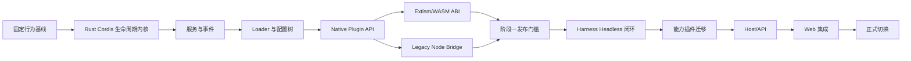

# Tessivum 二阶段开发计划

> 状态：已批准的实施指引  
> 基线日期：2026-08-17  
> 适用范围：Rust Cordis 内核、DeepSeek Harness Host/Agent Runtime 迁移、现有插件生态兼容

## 1. 文档集

本计划负责工作顺序、交付物和验收门槛。具体设计见：

- [目标运行时架构](ARCHITECTURE.md)：Context、生命周期、事件、Native/WASM/Legacy Node 三运行时和浏览器边界。
- [插件生态兼容方案](PLUGIN_COMPATIBILITY.md)：现有 npm 插件兼容级别、Legacy Node Bridge、WASM ABI 和迁移路径。
- [`reference.md`](../../reference.md)：最初的技术方向与选型讨论，仅作背景，不覆盖本计划中的源码分析结论。

如实现与本文冲突，先更新本文和关联架构文档，再修改代码；不能让代码和实施指引长期分叉。

## 2. 目标与边界

### 2.1 总目标

分两个阶段完成：

1. 建立可独立发布的 Rust Cordis 项目，重现 DeepSeek Harness 实际依赖的 Context、服务依赖、生命周期、事件和 Loader 语义，并提供 Native Rust、Extism/WASM、Legacy Node 三种插件运行方式。
2. 基于 Rust Cordis 迁移 DeepSeek Harness 的 Host 与 Agent Runtime；先完成 Headless 纵向闭环，再迁移能力插件、Host/API 和 Web 集成。

最终系统的运行时分工：

```text
Native Rust       核心、高频、可信插件
Extism/WASM       新的跨语言或非可信扩展
Legacy Node Host  现有 npm/Cordis 插件
TypeScript Web    现有 React/浏览器插件
```

### 2.2 明确不做

- 不逐行翻译 TypeScript，也不在 Rust 中仿造 JavaScript Proxy、原型链或声明合并。
- 不把 Harness 核心服务全部放进 WASM。
- 不声称 Extism 可以原样运行现有 npm/Cordis 插件。
- 不在第一轮迁移中重写 React UI。
- 不以未经测量的“单 Agent 2 MB”或“数万 Agent”作为验收承诺。
- 不保留无期限的双实现；每个迁移单元达到替换门槛后删除对应的新旧胶水之一。

## 3. 源码基线与事实来源

已下载的只读上游源码：

| 项目 | 本地路径 | 固定提交 |
|---|---|---|
| Cordis | `upstream/cordis` | `47f943859bef60e4160492346772ded9b24f765a` |
| DeepSeek Harness | `upstream/deepseek-harness` | `8cc9e33fab69e2d0476d126baaf2acb24e6a6ab4` |

Rust Cordis 的行为基线不是单独的最新上游 Cordis，而是：

1. Harness vendored Cordis 基线 `56b3d4f725681cf4556c1a8695a709cc3b6eed74`；
2. [`vendor/README.md`](../../upstream/deepseek-harness/vendor/README.md) 记录的 Harness 本地修改；
3. 当前 Cordis 上游已经吸收的后续修复。

发生冲突时优先级：

```text
Harness 当前可观察行为
  > Harness vendored 补丁契约
  > 当前 Cordis 上游行为
  > 历史实现细节
```

上游源码只作为分析和差分基线，不直接复制进新项目的运行目录。

## 仓库与版本管理

独立品牌统一命名为 **Tessivum**，由 *tessera*（可组合单元）与 *aevum*（时间/生命周期）构成。主产品、CLI 与 Harness 仓库使用 `tessivum`；独立框架仓库和核心 crate 使用 `tessivum-core`。

Cordis 与 Harness 使用两个独立 Git 仓库，从第一天保持单向依赖：

```text
tessivum-core                独立框架仓库
    ↑ tagged crate / release
tessivum                     Harness 产品仓库与 CLI
```

建议本地为同级目录，而不是嵌套仓库、Git submodule 或 subtree：

```text
SCHarness/                    # 本地总工作区，不是项目仓库
├── upstream/                 # 只读参考源码
├── reference.md
├── tessivum-core/            # 独立 Git 仓库
└── tessivum/                 # 独立 Git 仓库
```

仓库职责：

| `tessivum-core` | `tessivum` |
|---|---|
| Context、Scope、Fiber、Service、Events | Agent、Session、LLM、Tools 等领域服务 |
| 通用 Loader/Entry Tree 与事务生命周期 | profile/bundle 产品组合和默认配置 |
| Native Plugin API、WASM ABI、PDK | Harness Native 插件与 WASM 能力协议 |
| 通用 Legacy Node transport/runtime | tools/agents/sessions 等 Harness 服务代理 |
| Cordis 行为夹具、ABI 与 bridge 协议 | Headless、CLI、Host/API、Web 与端到端测试 |

依赖规则：

1. Harness 可以依赖已发布或已打 tag 的 Cordis；Cordis 不得导入 Harness crate、类型或协议。
2. 通用插件 ABI、生命周期和 bridge transport 归 Cordis；领域服务 wire（如 `tools@1`、`agents@1`）归 Harness。
3. 正常构建固定 Cordis 版本并提交 `Cargo.lock`。本地联调可使用不提交的 Cargo path/patch override，禁止把开发机绝对路径写进 manifest。
4. Cordis release candidate 必须触发 Harness 对固定集成场景的兼容检查；通过后才能发布 Cordis stable/tag。
5. 不创建第三个“shared”仓库。真正通用的契约放 Cordis，产品契约放 Harness；跨仓库夹具由 Cordis 版本化发布供 Harness 测试消费。
6. 两仓库 `main` 始终可构建；使用短期 feature branch，不建立长期 `phase-1`/`phase-2` 分叉。

Issue 归属：最小 Cordis fixture 可复现的问题归 `tessivum-core`；Agent/Session/工具等产品行为归 `tessivum`；bridge transport 问题归核心仓库，具体 Harness 服务代理问题归产品仓库。

`SCHarness/` 仅作为本地总工作区；`upstream/` 与 `reference.md` 只供研究，不进入产品发布物。`tessivum-core/` 是阶段一独立框架仓库，`tessivum/` 是阶段二产品仓库并持有本路线图。核心框架专属公开接口文档归 `tessivum-core`；本文链接核心框架的固定 release/tag 文档，避免复制两份可漂移的规范。

## 4. 总体交付顺序



阶段二不得在阶段一接口仍频繁破坏时开始大规模迁移。允许用一个最小 Headless 探针提前验证接口，但该探针不能变成第二套临时框架。

---

# 阶段一：Rust Cordis 独立项目

## 5. 阶段一完成定义

阶段一完成意味着 Rust Cordis 能独立运行、测试和发布，并满足：

- Context/Scope、服务注册、依赖门控、隔离和配置拦截可用；
- Fiber 生命周期与异步资源释放符合 vendored Cordis 行为；
- 五种事件分发模式可用；
- Loader 可以组合、更新和回滚配置树；
- Native Rust 插件能完整使用上述能力；
- Extism/WASM 插件能通过版本化 ABI 注册和调用能力；
- 现有 npm/Cordis 插件能由 Legacy Node Host 装载；
- 行为一致性由自动化契约测试证明；
- 阶段二只依赖已发布接口，不访问 Cordis 内部状态。

## 6. 建议仓库结构

先按真实编译目标和进程边界拆分，避免为目录美观创建空 crate：

```text
tessivum-core/
├── Cargo.toml
├── crates/
│   ├── tessivum-core/        # Context、Scope、Fiber、Service、Events、Loader
│   ├── tessivum-extism/      # Extism Host adapter
│   ├── tessivum-pdk/         # Rust/WASM Guest SDK
│   └── tessivum-node-bridge/ # Rust 侧 Legacy Node 客户端与协议
├── node/
│   └── compat-host/           # 原版 Cordis + npm 插件执行进程
├── fixtures/
│   └── conformance/           # TS/Rust 共用的行为夹具
└── examples/
    └── minimal/               # 最小可运行组合
```

`tessivum-core` 内部先使用普通 Rust module。只有出现独立发布、目标平台或依赖隔离要求时才继续拆 crate。

## 7. 阶段一里程碑

### 1.1 行为基线与契约夹具

交付物：

- 从 `vendor/cordis` 测试和 Harness 本地补丁中提取行为矩阵；
- 定义与语言无关的状态轨迹格式，例如插件状态、服务可见性、事件顺序和资源释放顺序；
- 建立 TypeScript oracle runner 与空的 Rust runner 接口；
- 固定错误分类，区分配置错误、依赖等待、插件失败、资源释放失败和协议错误。

必须覆盖：

- Pending → Loading → Active → Unloading → Disposed；
- Failed、重启和配置更新；
- 父子插件；
- 同步与异步 disposer；
- 初始化中 dispose、卸载中重复 dispose、初始化失败回滚；
- 服务增删导致的依赖插件卸载和重载；
- isolate realm；
- emit、parallel、serial、bail、waterfall。

验收：同一夹具可在 TypeScript oracle 中产出稳定轨迹，且夹具不依赖源码文本或私有字段。

### 1.2 Context、Scope 与 Fiber 生命周期

交付物：

- `Context` 与父子 Scope；
- `FiberId`、状态机和状态通知；
- 显式 `async dispose()`；
- Scope 拥有的资源表；
- 子 Fiber 归属；
- 取消与静默等待；
- 反向 cleanup 顺序；
- 幂等 dispose 和失败聚合。

关键不变量：

1. 非 Active/Loading/Pending 的 Scope 不能注册新资源。
2. 父 Scope 完成 dispose 前，所有子 Scope 和异步清理必须静默。
3. 初始化失败必须撤销初始化过程中注册的全部资源。
4. `Drop` 不代替异步 dispose；只能触发兜底取消或诊断。
5. 资源所有权只属于一个 Scope，转移必须显式。

验收：生命周期契约夹具全部通过，无遗留任务、监听器或服务。

### 1.3 Service Registry、依赖门控与隔离

交付物：

- 进程内 Native Service Registry；
- 服务键、实现版本和拥有者 Scope；
- required/optional dependency；
- 依赖缺失时 Pending；
- provider 出现、替换、消失时的重新求值；
- isolate realm；
- 配置 intercept 链；
- Native service handle 与跨运行时 resource handle 的明确区分。

关键不变量：

- 插件不会在 required service 缺失时部分启动；
- provider 消失后，consumer 不保留可继续调用的悬空引用；
- 不同 isolate realm 的同名服务互不可见；
- 跨进程/跨 WASM 边界不传递 Rust 引用或 JavaScript 对象。

验收：服务替换、隔离和依赖恢复轨迹与 oracle 一致。

### 1.4 Event Bus

交付物：

- `emit`、`parallel`、`serial`、`bail`、`waterfall`；
- listener 与注册 Scope 绑定；
- prepend/global/scoped filter 对应语义；
- 回调失败与聚合规则；
- 跨运行时事件的可序列化 envelope。

关键不变量：

- 同步模式不隐藏异步工作；
- waterfall listener 只有调用 `next` 才委托下游；
- listener 卸载后不能再次被调度；
- 单插件实例内的跨运行时调用串行化，防止重入破坏 Guest 状态。

验收：事件顺序、短路值、错误和卸载行为均有契约测试。

### 1.5 Loader、Profile 与事务更新

交付物：

- Entry、Group、Tree；
- YAML/JSON 配置；
- stable entry id；
- inject/isolate/intercept 配置；
- bundle/profile patch；
-配置候选树与原子提交；
- 失败回滚到最后可运行树；
- 配置持久化的原子写；
- 插件 runtime 选择：native、wasm、legacy-node；
- HMR 的接口位置，但 HMR 文件监视可延后到本里程碑末尾。

`!!js` 不直接移植任意 JavaScript 求值。第一版仅实现已盘点的安全表达式或显式变量引用；无法表达的现有配置由 Legacy Node Loader 兼容路径处理。禁止为了兼容配置而在 Rust 主进程嵌入无约束 JavaScript `eval`。

验收：

- 现有 base/headless profile 可被解析为等价 Entry Tree；
- 候选插件失败不会破坏旧树；
- patch 优先级和整行 config 替换规则与 Harness 一致；
- 重复 id、无效依赖和未知 runtime 明确失败。

### 1.6 Native Plugin API

交付物：

- Native Plugin descriptor；
- load/update/unload 契约；
- typed config validation；
- Context 能力访问；
- 服务、事件和资源注册 API；
- 插件诊断快照。

Native API 优先为 Harness 核心服务服务，不追求模拟 TypeScript 的表面语法。

验收：使用 Native 插件完成 provider → consumer → provider replacement 的完整场景。

### 1.7 Extism/WASM ABI 与 PDK

交付物：

- `cordis.plugin/v1` ABI；
- 插件 manifest、ABI 版本、权限和依赖声明；
-标准入口：初始化、调用、事件、配置更新、停止；
- Host Functions：日志、服务调用、事件、注册、受控 I/O；
- JSON envelope 作为第一版复杂数据格式；
- Rust Guest PDK；
- 至少一个 TypeScript/JavaScript PDK 示例；
- 实例内存、调用时间、HTTP/WASI 和 capability 限制。

第一版不为高频 Token 流或内部 Agent 对象设计零拷贝 ABI；这些留在 Native Rust。只有基准证明 JSON 边界成为瓶颈时才引入 WIT/二进制编码。

验收：WASM 插件能注册工具、调用一个受控 Host Function、响应事件、更新配置并在卸载后失去全部能力。

### 1.8 Legacy Node Bridge

交付物：

- 每个 profile/trust realm 一个受管理 Node Host，而不是每插件一个进程；
- 原版 `@deepseek-ai/cordis` 和 npm Loader；
- framed JSON-RPC 或等价的有界消息协议；
- plugin/load、update、dispose、service/call、event/subscribe、registration/dispose；
- owner/process generation，Node 崩溃后清除全部归属资源；
- backpressure、超时、取消和退出握手；
- Rust 服务的 Node 代理与 Node 服务的 Rust 代理；
- 日志、错误和 stack 保留。

安全立场：Legacy Node 插件保持原来的信任等级；Node Bridge 是兼容边界，不是假装成 WASM 沙箱。

验收：无需修改地加载一个现有函数插件、一个 Service 插件、一个事件插件和一个异步 disposer 插件；Node Host 被终止后 Rust Registry 无残留注册。

### 1.9 阶段一发布门槛

必须同时满足：

- 所有行为夹具在 TypeScript oracle 和 Rust 实现中通过或有经过记录的有意差异；
- sanitizer/泄漏检查或等价运行时观测无残留任务；
- Native、WASM、Legacy Node 三条最小示例通过；
- Loader 回滚场景通过；
- ABI 与 bridge 协议具备版本协商；
- 公开接口和错误码有文档；
- 建立实际基准并保存基线，不使用估计数字代替测量；
- 发布一个供阶段二固定依赖的版本。

---

# 阶段二：迁移 DeepSeek Harness

## 8. 阶段二策略

按“可运行纵向链路”迁移，不按目录批量翻译。每个里程碑都必须能启动并执行真实场景。

迁移期间的四条路径：

```text
已迁移 Host 核心       → Native Rust
尚未迁移的 npm 插件    → Legacy Node Bridge
新的第三方扩展         → Extism/WASM
浏览器 React 插件      → 现有 TypeScript Cordis
```

## 9. 阶段二里程碑

### 2.1 持久契约与 Headless 主干

先冻结会跨新旧系统的持久/传输契约：

- SessionId、MessageId、ToolCallId；
- SessionEvent JSON 形状与顺序；
- LLM Message、ContentBlock、StreamChunk；
- Tool schema、调用和结果；
- 结构化错误；
- cancel cause 与终态；
- profile/config identity。

随后迁移：

1. `llm/llm`；
2. `core/session`；
3. `core/system-prompt`；
4. `core/tools`；
5. `core/agent`；
6. `core/agent-loop`；
7. `bundle/headless`；
8. CLI headless 入口。

真实验收场景：

```text
输入任务
→ 创建持久 Session
→ 创建 Agent
→ 组装 Prompt 与 Tool schema
→ 流式调用 LLM
→ 执行至少一次工具调用
→ 追加完整 SessionEvent
→ 输出最终回答
→ Dispose 到静默
→ 从持久日志恢复并继续
```

迁移完成标准：同一录制 LLM 响应下，Rust 与 TypeScript 产生等价的持久事件序列和模型可见历史。

### 2.2 持久化、配置与基础运行能力

迁移：

- settings、credentials；
- session persistence JSONL/SQLite；
- session projection/query；
- attachment/storage；
- subprocess、shell、sandbox；
- filesystem；
- code runtime；
- telemetry 和 shutdown drain。

优先保证：

- 原有 session 可以读取；
- 新日志可被现有工具检查；
- 原子写和崩溃恢复不退化；
- sandbox/approval 仍然 fail closed；
- 进程退出等待持久化和 telemetry drain。

### 2.3 Agent 能力插件

按 Service Definition → Provider → Consumer 迁移：

- skills；
- LSP；
- MCP；
- Web search/fetch；
- jobs；
- subagent；
- workflow；
- compaction；
- goals、plan、todo；
- hooks 与交互审批。

每项能力必须保留：

- 服务接口；
- provider 选择规则；
- 工具 schema；
- cancellation；
- durable/model-visible 事件；
- 权限边界。

不为了统一目录把单一实现拆出假接口；只有当前确有 Definition/Provider/Consumer 三种独立角色时保留 seam。

### 2.4 现有插件生态接入

交付物：

- Rust profile Loader 识别现有 npm 插件；
- npm 插件自动路由到 Legacy Node Host；
- 首批跨运行时代理：tools、systemPrompt、llm、sessions、agents、logger、timers；
- Node 插件贡献能被 Native Rust Agent 看到；
- Node 插件卸载、崩溃和 profile 更新能完整清理；
- 插件兼容报告工具，指出直接兼容、需代理或必须移植的 API。

验收：选择真实社区插件样本，而不是只使用自制 fixture；至少覆盖工具、服务、事件、Node API 和浏览器 client half 类型。

### 2.5 Host、API 与 SDK

迁移：

- app boot 与命令行交接；
- HTTP/SSE/WebSocket；
- API Gateway/Remote；
- Headless SDK/ACP/JSON-RPC；
- frontend static 与 client module manifest；
- graceful shutdown。

验收：

- 现有 TypeScript/Python SDK 契约测试通过；
- 浏览器可建立连接、创建/恢复会话、发送消息、接收流式事件；
- 断线重连不丢持久事实；
- Host 退出没有孤儿子进程或 Node Bridge。

### 2.6 Web 集成

第一轮保留 React/TypeScript Browser Cordis：

- Rust Host 生成兼容的 `window.__DSH_BOOT__` 或替代 manifest；
- 继续提供 client bundle；
- 保持 Remote、SessionEvent 和 SSE wire；
- 保持现有 UI 插件 roster；
- 动态 browser half 继续运行在浏览器 JavaScript guard 中。

只有在 Host/Agent Runtime 稳定后，才决定是否：

1. 保留浏览器 Cordis 作为长期边界；
2. 将 Rust Cordis 编译到浏览器 WASM；
3. 用普通 React store/API 替代浏览器 Cordis。

这项选择不得阻塞阶段二 Host 迁移。

真实验收：使用浏览器完成新会话、流式响应、工具展示、审批、停止、恢复、插件 UI 和设置更新。

### 2.7 正式切换与删除旧主干

切换条件：

- Headless、ACP、SDK、Web 关键场景全部通过；
- 持久 Session 兼容；
- 目标社区插件样本通过；
- 性能、内存、启动和关闭基准不低于批准阈值；
- 安全边界复核完成；
- 故障回滚路径经过演练。

切换动作：

- CLI 默认入口改为 Rust；
- TypeScript Host/Agent Runtime 停止发布；
- 删除仅供双运行时过渡使用的适配胶水；
- 保留 Legacy Node Host 和 Browser Cordis，因为它们是明确的兼容产品边界，而非临时旧主干；
- 更新用户迁移说明和插件作者指南。

## 10. 测试与验证策略

### 10.1 行为契约测试

测试可观察行为，而非源码形状：

- 状态转换；
- 服务可见性；
- 事件顺序和短路；
- disposer 次序与静默；
- 配置提交/回滚；
- 持久事件序列；
- wire 请求与响应；
- 插件崩溃后的资源清理。

### 10.2 差分测试

对可重复输入同时运行 TypeScript oracle 和 Rust：

- 固定配置；
- 固定 LLM replay；
- 固定时钟和 ID；
- 比较归一化后的状态轨迹和 SessionEvent。

不比较 stack 行号、内部 Fiber ID 或日志时间戳等实现细节。

### 10.3 端到端场景

每个永久功能以真实入口验证：

- `headless`：实际启动并完成任务；
- SDK/ACP：实际客户端建立会话；
- Web：真实浏览器交互；
- 插件：实际 npm/WASM 包加载；
- shutdown：实际发送信号并确认进程树退出。

### 10.4 基准

阶段一发布前建立基线：

- 空 Context/每 Fiber 内存；
- 1/100/1000 插件启动与卸载；
- 服务替换风暴；
- emit/waterfall 吞吐；
- Native/WASM/Node Bridge 单次和批量调用；
- LLM 流式转发；
- Headless 启动时间和完整任务资源峰值。

阈值由首轮测量和产品目标共同批准；计划中不预先伪造结果。

## 11. 安全要求

- Native Rust 插件与 Legacy Node 插件均视为可信代码；权限由进程和 Harness policy 约束。
- WASM 插件默认无文件、网络、环境变量、时钟和随机数能力；逐项授予。
- Host Functions 必须检查插件身份、Scope、权限和输入上限。
- Legacy Node Bridge 不宣称是安全沙箱；它必须能被独立终止并清理归属资源。
- 动态插件不得获得真实 Context、Rust 引用、数据库连接或未包装的文件句柄。
- 跨边界消息必须设置大小、并发、超时和队列上限。
- 配置表达式不允许在 Rust 主进程执行任意 JavaScript。

## 12. 主要风险与控制

| 风险 | 后果 | 控制 |
|---|---|---|
| 异步 dispose 与 Rust `Drop` 不匹配 | 资源泄漏或关闭竞态 | 显式 `async dispose`、Scope 静默门槛、泄漏场景测试 |
| 模拟 TS API 而非行为 | Rust 复杂度膨胀 | 以契约轨迹为准，使用显式类型与 handle |
| WASM 承担高频内部调用 | 序列化和调度开销 | 核心留在 Native，基准后才扩 ABI |
| Legacy Bridge 无限代理表面 | 永远迁不完 | 优先常用稳定 seam，其余保持在 Node 子图内 |
| Node Bridge 崩溃留下注册 | 活运行时污染 | process generation + owner-wide cleanup |
| `waterfall` 跨进程重入 | 死锁 | correlation id、单实例串行调用、禁止循环等待 |
| 配置 `!!js` 兼容 | 任意代码执行 | 安全表达式 + Legacy Loader 兼容路径 |
| 浏览器插件误塞进 Extism | React/DOM 能力丢失 | Browser Cordis 保留为独立平面 |
| 上游持续变化 | 基线漂移 | 固定 SHA、定期显式 rebase review、差分夹具 |
| 持久日志形状变化 | 用户会话不可恢复 | 先冻结 wire，版本化迁移和双向 fixture |

## 13. 决策门槛

下列决策必须以测量或真实兼容样本为输入，不能提前凭偏好决定：

- JSON ABI 是否需要升级为 WIT/二进制编码；
- Legacy Node Host 是每 profile 还是每 trust realm；
- 哪些服务值得跨运行时代理；
- 浏览器 Cordis 是长期保留、WASM 化还是移除；
- HMR 是否进入首个稳定版；
- Rust 主干达到何种资源阈值才切换默认入口。

## 14. 后续工作入口

开始实现时，第一项工作固定为阶段一 `1.1 行为基线与契约夹具`。在该夹具能稳定描述现有 Cordis 行为前，不创建完整框架脚手架，也不先接 Extism。
