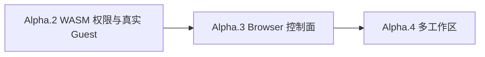

# Tessivum Phase 3 产品能力开发计划

> 状态：已完成（`v0.1.0-alpha.2` 至 `v0.1.0-alpha.4`）
> 基线版本：`v0.1.0-alpha.1`  
> 基线提交：`af1989b`  
> 适用仓库：`wavetao2010/tessivum` 与其固定依赖 `wavetao2010/tessivum-core`  
> 计划范围：WASM 权限与真实插件、Browser 控制面、多工作区

## 1. 文档目的

阶段一完成 Rust Cordis 内核，阶段二完成 Tessivum Rust Host/Agent Runtime、API/SDK、Legacy Node 与 Browser Cordis 集成。本计划定义 Alpha 基线之后的三个产品里程碑，作为实现顺序、接口边界、测试矩阵和发布门槛的唯一执行指引。

如实现需要偏离本文，先更新本文及关联架构文档，再修改代码。不得以“先留兼容分支”为由长期保留两套权威状态或两条行为不同的 wire。

关联文档：

- [目标运行时架构](ARCHITECTURE.md)
- [二阶段开发计划](DEVELOPMENT_PLAN.md)
- [插件生态兼容方案](PLUGIN_COMPATIBILITY.md)
- [Phase 4 品牌、分发与社区市场开发计划](PHASE4_BRAND_DISTRIBUTION_MARKET_PLAN.md)：后续独立品牌、安装渠道与 dshmarket 真实兼容边界。

## 2. 项目定位与明确边界

Tessivum 是独立社区 Rust 化项目。它不隶属于 DeepSeek，不修改、不替代、也不参与官方 DeepSeek Harness 的仓库治理、npm 发布或停发流程。CI 中固定读取官方仓库，只用于兼容夹具和行为验证。

本阶段继续保留两条明确的兼容边界：

```text
Legacy Node Host  → 现有 npm/Cordis 服务端插件
Browser Cordis    → 现有 published React/浏览器插件
```

本阶段明确不做：

- 不修改或停发官方 DeepSeek Harness；
- 不重写 Browser Cordis/React UI；
- 不把现有 npm 插件自动转换为 WASM；
- 不给 WASM 权限引入 `*` 通配符或“信任所有方法”；
- 不允许 Browser 直接提交任意 Host 文件路径来绕过 WorkspaceRegistry；
- 不把多工作区实现成多个互相独立、不可统一关闭的 HostRuntime；
- 不为了未来扩展先创建没有第二个真实实现的抽象层。

## 3. 当前 Alpha 基线

`v0.1.0-alpha.1` 已具备：

- Rust Host、Agent、Agent Loop、Session、Tools、System Prompt；
- JSONL/SQLite 持久会话、冷恢复、rollback 与 graceful shutdown；
- Headless CLI、HTTP、durable SSE、Browser WebSocket、NDJSON JSON-RPC/ACP SDK；
- TypeScript/Python SDK 客户端；
- Legacy Node generation cleanup 与真实 Cordis 社区插件样本；
- Browser workspace/session、实时响应、tool card 与 reload 恢复；
- Native/WASM/Legacy/Browser package 路由与兼容报告。

当前三个真实缺口：

1. `DomainBridge` 对 WASM `cordis.service.call` 默认返回 `CAPABILITY_DENIED`，尚无 per-plugin 方法级授权；
2. Browser 可停止/审批/设置的完整控制面尚未形成端到端可验证契约；
3. 一个 Host profile 只拥有一个 canonical cwd，非默认 workspace 会 fail-loud。

## 4. 总体实施顺序



顺序不可交换的原因：

- WASM 权限是非可信插件调用 Settings、Credentials 等服务的安全前提；
- Browser 控制面先冻结 Host 的审批、取消和配置写入契约，供多工作区 UI 复用；
- 多工作区会改变 Session 创建、工具 cwd、Filesystem、Skills 和 sandbox 的资源根，影响面最大，必须最后实施。

目标发布：

| 版本 | 主题 | 发布条件 |
|---|---|---|
| `v0.1.0-alpha.2` | WASM 权限与真实 Rust Guest | allow/deny/limit/trap/unload 全部通过 |
| `v0.1.0-alpha.3` | Browser 控制面 | stop、approval、settings/credentials 真实浏览器通过 |
| `v0.1.0-alpha.4` | 多工作区 | 双工作区、重启恢复、工具资源根与越界拒绝通过 |

## 5. 跨里程碑共享约束

### 5.1 权威状态

- 持久事实必须先提交，再发送通知或成功响应；
- Browser localStorage 只保存导航偏好，不保存权威 Session、approval、settings 或 workspace 状态；
- WASM Guest 只持有 Host 签发的 opaque handle，不能持有 Rust 引用或真实文件句柄；
- WorkspaceRegistry 是 workspace/排序/archive 的唯一权威，Session log 是会话事件的唯一权威。

### 5.2 生命周期

每个资源必须有明确 owner：

```text
HostRuntime
  ├── WasmPolicyRegistration → WasmPluginInstance
  ├── Approval pending entry → Agent generation / turn
  ├── Settings registration → owning plugin/profile
  └── Workspace lease → WorkspaceRegistry generation
```

卸载顺序固定为：拒绝新调用 → 取消在途调用 → 等待 bounded drain → 删除注册/权限 → drop 实例。

### 5.3 安全默认值

- 未声明权限一律拒绝；
- secret 只写不读，所有 describe 输出必须 redacted；
- 所有目录先 canonicalize，再比较 containment；
- API 继续保持 loopback-only 与 WebSocket Origin 校验；
- 所有跨边界 payload、队列、并发、timeout、fuel 和 memory 都必须有上限；
- 新增拒绝路径必须返回稳定错误 code，不能靠错误字符串驱动控制流。

### 5.4 Clean cutover

每个里程碑完成时：

- 删除被新实现替代的临时分支、旧 DTO、旧测试夹具和兼容 alias；
- 同时迁移所有 caller；
- 不保留 deprecated HostApi 或双写存储；
- published Browser wire 必须保持现有字段和错误码，除非先版本化协议。

---

# 里程碑 A：WASM 权限与真实插件

> 状态：已完成，发布目标 `v0.1.0-alpha.2`。

## 6. A 阶段目标

把当前“全部 Host service call 默认拒绝”升级为“双层授权”：

1. `tessivum-core` 继续检查通用 Capability，例如 `cordis.service.call`；
2. Tessivum 根据不可伪造的 `instance_id`、manifest `plugin_id` 与 Loader `entry_id` 检查精确的 `service@version + method`。

两层必须同时允许，请求才可进入 `DomainBridge::dispatch_native`。

## 7. Manifest 契约

保持核心 `PluginManifest.permissions: Vec<Capability>` 不变，在产品 package declaration 增加 `servicePermissions`：

```yaml
schemaVersion: cordis.plugin/v1
id: com.example.inspect
version: 0.1.0
runtime: wasm
entry: plugin.wasm
abi: cordis.plugin/v1

permissions:
  - cordis.log
  - cordis.service.call

servicePermissions:
  - service: logger@1
    methods:
      - log
  - service: settings@1
    methods:
      - describe
  - service: tools@1
    methods:
      - schemas

configSchema:
  type: object
  additionalProperties: false
exports:
  - cordis_init
  - cordis_call
  - cordis_event
  - cordis_update
  - cordis_stop
```

该文档是 Tessivum package declaration，不直接交给 `PluginManifest::from_json`。产品 parser 必须把 `id/version/entry/abi/inject/permissions/configSchema/exports` 投影成核心 `PluginManifest`，同时把 `servicePermissions` 保留在 Tessivum policy 中；两者由同一个 plugin lifetime owner 提交和撤销。

规则：

- `service` 必须使用版本化常量，如 `logger@1`；
- `methods` 必须是非空、去重、精确字符串集合；
- 禁止 `*`、前缀匹配、正则和任意 service；
- 声明 `servicePermissions` 时必须同时声明通用 `cordis.service.call`；
- 未声明 `servicePermissions` 等价于空集合；
- 未知 service/method 在实例化前失败，不把错误推迟到第一次调用；
- 同一 `plugin_id` 在一个 Loader tree 内唯一；
- config、entry confinement 和 ABI 仍先于权限安装验证。

首轮允许目录保持最小：

| service | 首轮方法 | 说明 |
|---|---|---|
| `logger@1` | `log` | 无 secret，适合作为真实 Guest 正向样本 |
| `tools@1` | `schemas` | 只读；`execute/register` 暂不授权 |
| `settings@1` | `describe` | 只返回 redacted descriptor |
| `credentials@1` | `describe` | 只返回 configured/source/writable，不返回 value |

`llm@1.generate`、`sessions@1.append`、`agents@1.send/cancel`、`tools@1.execute/register` 属于成本或状态变更能力，只有完成 opaque owner/cost policy 后才能进入目录。

## 8. A 阶段核心类型

在 Tessivum 产品层增加：

```text
ServiceMethodPermission {
  service: String,
  method: String,
}

WasmEffectivePolicy {
  plugin_id,
  instance_id, // opaque generation authority
  entry_id,    // logical Loader owner
  methods: BTreeSet<ServiceMethodPermission>,
}

WasmPolicyRegistry {
  install(policy) -> WasmPolicyRegistration,
  authorize(instance_id, plugin_id, service, method),
}
```

`WasmPolicyRegistration` 是唯一卸载 handle。Drop 只能做同步撤销标记；完整停止仍走 async dispose。

授权表以不可伪造的 `instance_id` 为调用 authority；同一 Loader `entry_id` 的 committed/candidate generation 可在事务切换期间短暂重叠。相同 `plugin_id` 被不同 entry 占用时必须拒绝，旧 generation 撤销后其 authority 不可复用。

错误码冻结：

| code | 场景 |
|---|---|
| `MANIFEST_PERMISSION_INVALID` | 空值、重复、通配符、未知 service/method |
| `CAPABILITY_DENIED` | 核心 Capability 未授权 |
| `SERVICE_PERMISSION_DENIED` | service/method 未授权 |
| `PLUGIN_POLICY_NOT_FOUND` | plugin 未安装或已经卸载 |
| `PLUGIN_POLICY_ALREADY_REGISTERED` | instance authority 重复，或 plugin id 被另一个 Loader entry 占用 |
| `INSTANCE_STOPPED` | 实例停止后继续调用 |
| `RESOURCE_LIMIT` | fuel/memory/input/output/concurrency 超限 |

## 9. A 阶段实施步骤

### A0. 冻结夹具

新增 manifest 夹具，覆盖：合法最小权限、空 methods、重复、通配符、未知 service、缺少 `cordis.service.call`、路径 traversal、重复 plugin id。

### A1. 严格解析 package declaration

修改 `src/plugins.rs`：

- `validate_manifest` 校验 `servicePermissions`；
- `RuntimeDeclaration`/`PluginPackage` 保留 typed product permissions，不只保留 runtime/entry；
- compatibility report 输出所需 service/method，不输出 config secret；
- 外部 manifest 与 `package.tessivum.plugin` 使用同一 parser。

### A2. 接通 policy registry

修改 `src/bridge.rs`：

- `CapabilityHandler` 从 `CapabilityRequest.plugin_id` 读取 policy；
- 先 bounded decode `DomainRequest`，再检查精确 service/method；
- 授权后才调用 `dispatch_native`；
- policy missing、unloaded 和 stale id 都 fail closed；
- 日志只记录 plugin id、service、method、结果 code，不记录 payload/secret。

### A3. 组合 WasmPluginRuntime

重构当前仅包含 Legacy runtime 的 `legacy_loader`：

```text
product_loader(
  resolver,
  native runtimes?,
  WasmPluginRuntime,
  LegacyNodeRuntime?,
)
```

- Host boot 注册 `CapabilityRegistry` 和 `WasmPluginRuntime`；
- package 校验成功后先安装 policy，再实例化 Guest；
- init 失败时反向删除 policy；
- stop 顺序固定为 instance.stop → drain → policy unregister；
- 不允许 WASM 实例复用另一个 plugin id 的 policy。

### A4. 真实 Rust Guest

新增 `fixtures/wasm/rust-minimal/`：

- 保存 guest source、manifest、构建说明、固定 `.wasm` 与 SHA-256；
- `cordis_init` 调用允许的 `logger@1.log`；
- `cordis_call` 返回确定性 JSON；
- 测试路径主动调用一个未授权方法；
- 另一个 export 可触发确定性 trap。

CI 使用固定 `.wasm` 运行；单独的 rebuild check 验证 source 仍能生成相同 ABI/export，不要求每次普通测试安装额外 target。

### A5. 生命周期与限额

- 每实例串行调用；
- timeout、fuel、memory pages、input/output 继承 `ResourceLimits`；
- timeout/trap 后实例状态必须可查询；
- trap 只停止当前实例；
- unload 后旧 handle 返回 `INSTANCE_STOPPED`；
- Host shutdown 等待实例 stop，不遗留 in-flight call。

### A6. A 阶段清理与发布

- 删除 `DomainBridge` 当前 unconditional deny 临时代码；
- 更新插件兼容报告与文档；
- 运行全量回归、真实 Guest E2E、资源阈值测量；
- 发布 `v0.1.0-alpha.2` prerelease。

## 10. A 阶段验证矩阵

| 层次 | 必须覆盖 |
|---|---|
| parser | schema、重复、通配符、未知 method、Capability/service 依赖 |
| unit | policy install/authorize/revoke、plugin id 隔离 |
| integration | real Extism module allow/deny、config、update、stop |
| failure | trap、timeout、fuel、memory、oversize、stale handle |
| lifecycle | init rollback、unload drain、Host shutdown |
| security | secret redaction、payload 不进日志、无权限默认拒绝 |
| E2E | Loader 从 package manifest 启动 Rust Guest 并完成一次真实调用 |

A 阶段完成定义：真实 WASM Guest 能完成一个被授权调用；同一 Guest 的未授权调用被稳定拒绝；trap/unload 不影响 Native、Legacy 和其他 WASM 实例。

---

# 里程碑 B：Browser 控制面

> 状态：已完成，发布目标 `v0.1.0-alpha.3`。

## 11. B 阶段目标

在不重写 published Browser Cordis/React UI 的前提下，接通三条真实 Host 控制链路：

```text
B1 Stop running turn
B2 Approval request/response/recovery
B3 Writable settings and credentials
```

现有 full-form RPC、mux/host WebSocket 和 durable SSE 字段保持兼容。

## 12. B1：停止运行中的 Turn

现有 `session.cancel`、Agent generation disposal 和 fresh-agent resume 已存在，但需要冻结真实 Browser 行为。

实施：

1. 增加可控的 blocking/delayed LLM adapter 测试 seam；
2. Browser 点击“停止生成”调用 `session.cancel`；
3. Host 取消当前 Agent generation，等待 bounded quiescence，发布 `host/session-status(running:false)`；
4. 未认领 queue item 按既定 contract 保留或清理，测试必须明确；
5. 下一条 prompt 使用 fresh generation 继续同一 durable session；
6. disconnect 与 cancel 并发遵循 first-wins，不重复写终态。

验收：真实 Chromium 中 stop 后 2 个现象同时成立——模型/工具不再输出，随后发送新消息可以成功完成。

## 13. B2：审批交互

### 13.1 Host 组合

当前 `ApprovalService` 已能记录 policy、asked/decided 和 answerer 生命周期。需要在每个普通 Agent generation 上创建并发布：

```text
ApprovalService
ApprovalToolGate
HostApprovalRegistry(session_id → generation-bound service)
```

Agent dispose 时撤销 answerer 和 pending owner；pending durable audit event 不删除。

### 13.2 Wire

沿用 published contract：

```text
Host ApprovalService
  → server-request approval/requested (stable rpcId)
  → Browser approval UI
  → POST /api/respond ClientResponse (echo rpcId)
  → RpcReceipt accepted/not-pending/bad-response
  → approval/resolved frame
```

`approval/requested` 至少包含 sessionId、approvalId、toolName、可选 callId/reason；Browser 只能回答 `allowed-once` 或 `rejected`。`cancelled`/`unavailable` 只由 Host 产生。

### 13.3 Pending 表

增加 bounded `PendingInteractionRegistry`：

- key 是 stable rpcId；
- value 绑定 session、approval id、Agent generation、deadline、answer channel；
- 注册 requested 前先持久化 `approval/asked`；
- resolve 成功后先持久化 decided，再发 resolved；
- duplicate/late response 返回 `not-pending`，不得重复决定；
- refresh/reconnect 从 durable asked/decided 差集重建仍 pending 的请求并复用 rpcId；
- Agent cancel/turn end 自动 resolve 为 Host-side cancelled。

### 13.4 审批测试

- allowed-once、rejected；
- two tabs race，第一响应获胜；
- refresh 后相同 rpcId 重放；
- late/duplicate response；
- turn cancel 与 Browser response 竞争；
- answerer panic/timeout fail closed；
- tool 只有 allowed-once 后执行一次。

## 14. B3：可写 Settings/Credentials

### 14.1 Host 服务组合

在 `HostRuntime::boot` 中创建并发布：

```text
Settings(YamlSettingsProvider(data_dir/settings.yaml))
Credentials(environment + YamlCredentialFile(data_dir/credentials.yaml))
```

HostConfig 只允许覆盖由 Host 选择的文件位置；Browser payload 不携带任意 Host path。

`Services` 保存对应 `ServiceHandle`，shutdown 顺序先拒绝写入、drain commit，再销毁 service。

### 14.2 Settings wire

实现：

- `settings.describe`
- `settings.update`
- `settings.replace`
- `settings.mutate`

`settings.openDocument` 在没有跨平台安全 opener 前保持 `hasDocument:false`，不做假成功。

Rust `SettingsDescriptor` 转 published `SettingsNamespaceView`：

```text
namespace → ns
resolved → value
base → base
user → user
schema → schema
secret_paths → secrets[{path,set}]
revision → revision
applies → live/restart（由 registration 声明）
```

每次写入必须携带可选 `expectedRevision`；冲突返回 `settings-conflict`，包含 expected/actual。响应和 WebSocket 通知只包含 redacted view 或 namespace，不返回 secret。

### 14.3 Credentials wire

实现：

- `credentials.describe(refs[])`
- `credentials.set(ref,value)`
- `credentials.unset(ref)`

要求：

- ref 使用现有严格环境变量名 validator；
- describe 永不返回 value；
- 环境变量 shadow 时 set/unset 返回稳定拒绝；
- secret 只在单次 HTTPS/loopback request body 内进入 Host，日志、error、event 均不能携带；
- 文件继续使用 0600 和 atomic replace/directory fsync；
- update 后发送 `host/credentials-changed {ref}`。

### 14.4 注册与 ownership

Settings namespace 由 profile/插件注册，首个 owner 胜出；卸载 owner 后 namespace 行为必须明确：

- durable user section 保留；
- schema/provider capability 消失；
- Browser 收到 invalidation 并重新 describe；
- owner 重载后在同 namespace 恢复 user layer。

## 15. B 阶段实施步骤

1. B1 先冻结 stop/cancel Browser E2E；
2. 将 ApprovalService 接入 Agent composition；
3. 扩展 HostNotification 与 mux frame adapter；
4. 增加 `/api/respond` pending registry；
5. 完成 reconnect replay 与 race tests；
6. 将 Settings/Credentials 发布到 Host root；
7. 实现 published settings/credentials DTO 转换；
8. 接入 updated invalidation frames；
9. 用真实 Browser settings/approval UI 验证；
10. 清理只读兼容返回与临时 no-op 分支；
11. 发布 `v0.1.0-alpha.3`。

## 16. B 阶段验证矩阵

| 场景 | 契约 |
|---|---|
| stop | running→idle、无后续 chunk、fresh generation 可继续 |
| approval | requested/respond/resolved、持久 audit、first-wins |
| reconnect | pending approval 同 rpcId 重放，历史不丢失 |
| settings | describe/update/replace/mutate、revision conflict、reload |
| secret | describe/error/event/log 均无值，环境 shadow fail closed |
| shutdown | pending approval 取消，settings commit drain，无 orphan |
| Browser E2E | stop、允许/拒绝审批、修改普通设置、写入/移除 credential |

B 阶段完成定义：真实 Chromium 可停止 turn、处理并恢复审批、修改非 secret 设置、写入 write-only credential；刷新和 Host 重启后权威状态一致。

---

# 里程碑 C：多工作区

> 状态：已完成，发布目标 `v0.1.0-alpha.4`。

## 17. C 阶段目标

把当前 Host 级单一 cwd 改造成“一个 HostRuntime 管理多个持久 Workspace，每个 Session 绑定一个受控资源根”。不得为每个 workspace 启动独立 HostRuntime。

## 18. Workspace 持久模型

新增 `WorkspaceRegistry`，持久文件建议为 `data_dir/workspaces.json`，使用 0600、atomic replace 和 parent fsync。

```json
{
  "schemaVersion": "tessivum.workspaces/v1",
  "revision": 7,
  "items": [
    {
      "workspaceId": "opaque-uuid",
      "path": "/canonical/project",
      "title": "project",
      "sessionIds": ["session-a"],
      "createdAt": "...",
      "updatedAt": "..."
    }
  ],
  "archivedSessionIds": []
}
```

不变量：

- path 必须是已存在、可读目录的 canonical path；
- 同一 canonical path 只能属于一个 workspace；
- workspace id 不从 path hash 推导，避免 path 泄漏和 rename identity 变化；
- title trim 后非空；同名冲突按 published contract 返回；
- `sessionIds` 是手动顺序，activity 不改变顺序；
- archive 不删除 Session log 或 workspace accounting；
- 删除 workspace 只删除注册，不删除目录和会话；
- registry 每次 mutation 在通知/响应前持久提交。

## 19. Opaque workspace authority

Browser 只能传 `workspaceId`，不能把任意 path 直接送入 Agent/Tool。

```text
WorkspaceRegistry.resolve(workspaceId)
  → WorkspaceLease { id, generation, canonical_root }
```

`WorkspaceLease` 字段对 wire 私有。Host 创建 Session 时接收 lease，而不是信任 Browser cwd。registry 删除/替换后旧 generation 失效。

允许 `workspace.create({path})` 的原因是它是 loopback-only 管理操作；该入口必须重新 canonicalize、验证目录并由 Host 签发 id。后续 Session/Tool 请求只使用 id/opaque authority。

## 20. Session 与 workspace 提交顺序

采用明确的两提交契约：

1. resolve `WorkspaceLease`；
2. 持久创建 blank SessionHeader，cwd 写 canonical root；
3. 向 WorkspaceRegistry attach session 并持久提交；
4. 成功后发送 `host/workspace-changed` 与 `host/session-added`；
5. attach 失败返回 `workspace-attach-failed` 和已创建 session id；Session 作为 ungrouped durable session 保留，可安全重试 attach。

不做跨两个文件的伪原子事务。恢复时通过 SessionHeader.cwd 与 registry accounting 检测并报告 drift；不得静默把任意 session 移入 default workspace。

## 21. 每会话资源根

当前 `BuiltinToolsConfig.cwd` 在 Host boot 时固定。多工作区必须移除该全局假设。

新增 `SessionResourceResolver`：

```text
resolve(session_id, WorkspaceLease)
  → canonical cwd
  → filesystem root
  → subprocess cwd
  → skills/project roots
  → sandbox policy input
```

规则：

- `echo` 等无 cwd 工具可继续全局注册；
- `bash`、filesystem、skills、LSP、code runtime 等 cwd-sensitive 能力按 `ToolRunContext.session` 查询资源根；
- handler 不接受模型提交的 cwd 覆盖；
- 每次恢复校验 SessionHeader.cwd 与 registry workspace path；
- workspace symlink/path 变化导致 fail-loud，不自动扩大权限；
- subagent 默认继承 parent workspace/cwd，显式跨 workspace delegation 本阶段不支持；
- session fork 继承 source workspace；
- concurrency cache key 必须包含 workspace generation，删除后旧缓存失效。

## 22. Workspace API

实现并冻结：

- `workspace.list`
- `workspace.create`
- `workspace.rename`
- `workspace.delete`
- `workspace.insertSessionBefore`
- `workspace.archiveSession`
- `session.create({workspaceId,...})`

Host frames：

- `host/workspace-changed`
- `host/workspace-removed`
- `host/archived-sessions-changed`
- `host/session-added` 中 cwd 与 workspace baseline 一致。

所有 mutation 支持幂等重试；未知 id、无效 path、name conflict、invalid move 使用 published 稳定错误 code。

## 23. 旧数据迁移

首次启用 `tessivum.workspaces/v1`：

1. 若 registry 已存在，只校验，不重新生成；
2. 若不存在，扫描 durable SessionInspection；
3. 按 canonical SessionHeader.cwd 分组；
4. Host 默认 cwd 建立 default workspace；
5. 其他存在且可读的 cwd 建立 workspace；
6. cwd 缺失、不可读或非法的 session 保持 ungrouped，并生成诊断；
7. 写入一个完整 registry snapshot；
8. 重启后同一迁移不产生新 workspace id。

迁移必须有 golden fixture，覆盖单 cwd、多 cwd、缺失 cwd、symlink、损坏 registry 和中断写入。

## 24. C 阶段实施步骤

1. 冻结 Workspace DTO、错误码和持久文件 fixture；
2. 实现 WorkspaceRegistry read/list/CAS mutation/atomic persistence；
3. 实现旧 Session migration；
4. 增加 WorkspaceLease generation authority；
5. 扩展 HostApi session create/attach；
6. 替换 CompatibilityState 的内存 default workspace；
7. 实现完整 published workspace API 和 Host frames；
8. 接通 SessionResourceResolver；
9. 迁移 bash/filesystem/skills/LSP/code runtime 的 cwd 获取；
10. 处理 subagent/fork inheritance；
11. 完成双工作区 Browser E2E、restart 和越界测试；
12. 删除单 cwd fail-loud 兼容分支；
13. 发布 `v0.1.0-alpha.4`。

## 25. C 阶段验证矩阵

| 场景 | 必须证明 |
|---|---|
| registry | create/list/rename/delete/order/archive、CAS、torn write recovery |
| security | traversal、symlink escape、deleted generation、Browser raw path 拒绝 |
| session | blank commit、attach retry、restart、ungrouped recovery、fork/subagent inheritance |
| tools | 两个 workspace 的 bash/filesystem/skills 只观察各自根 |
| Browser | 创建两个 workspace、各自新会话、切换、排序、archive、reload |
| failure | directory removed、registry corrupt、attach commit failure、Host shutdown |
| migration | 旧单 cwd Session 稳定进入 default，不重复生成 id |
| performance | 100 workspace/1000 session listing 不突破批准阈值 |

C 阶段完成定义：一个 HostRuntime 可管理至少两个真实目录；每个会话的工具和恢复严格使用所属 workspace；重启、删除、archive 和迁移后无权限漂移或持久状态丢失。

---

# 共同验证、发布与执行管理

## 26. 每个里程碑的强制验证

```bash
cargo fmt --all --check
cargo clippy --all-targets -- -D warnings
cargo test --all-targets
cd web && bun install --frozen-lockfile && bun run build
```

另需运行该里程碑的真实入口：

- A：真实 Extism `.wasm`；
- B：真实 Chromium；
- C：真实两个临时 workspace 目录与 Browser；
- 每项都必须执行 shutdown/restart 场景。

现有 Alpha 基线的 Headless、SDK、Legacy、Browser、rollback 和性能测试不可删除或降级。

## 27. 回归与性能门槛

沿用 `v0.1.0-alpha.1` 基线：

- Headless recorded replay ≤ 10 s；
- Web readiness ≤ 5 s；
- Web SIGTERM exit ≤ 5 s；
- RSS 不超过批准基线的 1.20×；
- 新 WASM 调用、approval pending、workspace listing 分别建立独立 baseline；
- 任一性能优化不得绕过权限、持久提交或 shutdown drain。

## 28. 分支与发布纪律

- `main` 始终通过 GitHub CI；
- 每个里程碑使用短期 feature branch；
- 一个 PR 只跨一个明确 contract seam；
- manifest/wire/persistence 变更必须在 PR 中附 fixture；
- 合并后先通过 main CI，再创建 annotated tag 和 GitHub prerelease；
- release notes 必须列出可观察能力、验证证据、已知限制和迁移说明；
- 不发布预编译二进制，除非另有跨平台签名/打包计划。

## 29. 文件影响地图

| 里程碑 | 主要文件/模块 |
|---|---|
| A | `src/plugins.rs`、`src/bridge.rs`、Host Loader composition、WASM fixtures、`tessivum-extism` integration |
| B1 | `src/host.rs`、`src/api.rs`、cancel/status tests、Browser E2E |
| B2 | `src/approval.rs`、Agent composition、HostNotification、pending registry、`/api/respond` |
| B3 | `src/settings.rs`、`src/credentials.rs`、Host Services、published DTO adapters |
| C | new WorkspaceRegistry、Session creation、cwd-sensitive tools、workspace API、migration fixtures |

跨仓库修改规则：只有通用 Extism/Loader ABI 缺口进入 `tessivum-core`；service/method permissions、approval/settings/workspace 等产品语义留在 `tessivum`。

## 30. 风险登记

| 风险 | 控制 |
|---|---|
| plugin_id policy TOCTOU | policy lifetime handle 与 instance 同 owner，先撤销 accepting 再删除 policy |
| service permission 粒度膨胀 | v1 精确 method allowlist，无 wildcard，只开放真实样本所需方法 |
| approval duplicate/refresh race | stable rpcId、durable asked/decided、pending first-wins |
| settings secret 泄漏 | write-only secret、redacted DTO、日志/error/event 扫描测试 |
| workspace 路径漂移 | canonical path、generation authority、每次恢复 containment 校验 |
| Session 与 workspace 双提交失败 | 显式 ungrouped durable fallback 与幂等 attach |
| cwd-sensitive 工具仍读 Host cwd | SessionResourceResolver 单一入口，禁止 handler 自行读取 process cwd |
| published Browser contract 漂移 | pinned package schema、real Chromium snapshot、Host DTO fixture |
| Legacy/Browser 被误删 | 保留独立兼容测试和文档边界，不把它们当过渡主干 |

## 31. 总完成定义

Phase 3 完成必须同时满足：

1. WASM Guest 只能调用 manifest 精确授权的方法，真实 Rust Guest 可运行且安全卸载；
2. Browser 可停止 turn、完成并恢复审批、读写 redacted settings/credentials；
3. 多工作区持久化、会话归属和 cwd-sensitive 工具权限在重启后保持一致；
4. Native、Legacy Node、Browser Cordis 的现有行为无回归；
5. 三个 Alpha prerelease 均有绿色 CI、真实 E2E、性能记录和明确 release notes；
6. 文档始终声明 Tessivum 是独立社区项目，不修改或取代官方 DeepSeek Harness。
