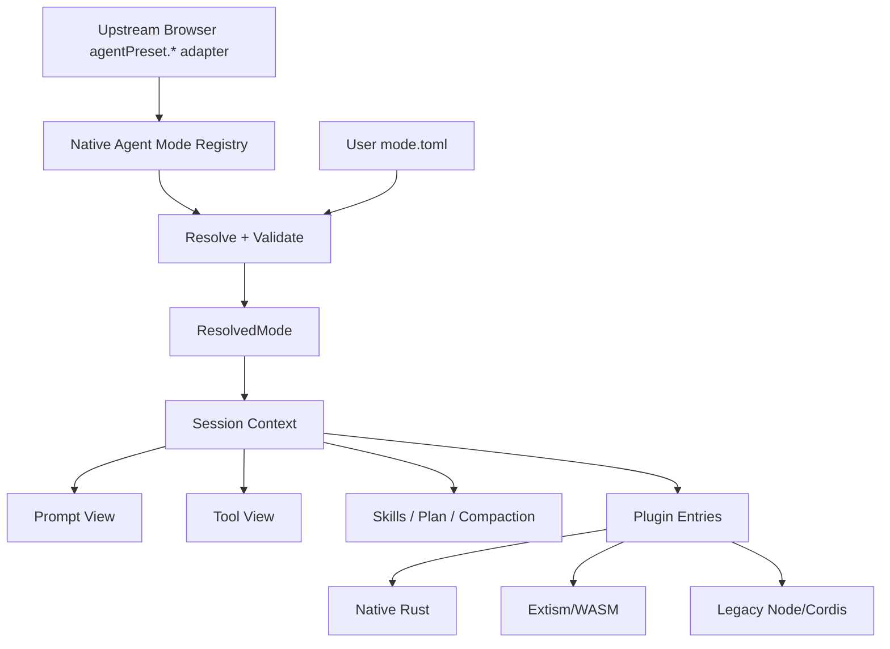

# Tessivum Phase 5 原生 Agent Mode 与插件组合开发计划

> 状态：已实现，进入持续回归
> 决策日期：2026-08-27
> 实现基线：`v0.1.0-alpha.12`
> Core 基线：`tessivum-core v0.1.5` / `a1a6d2e5584253391b9962c482f2140263b703bf`
> 上游兼容基线：DeepSeek Harness `0.1.0-rc.5` / `47f943859bef60e4160492346772ded9b24f765a`

## 1. 文档目的

本阶段已把 Tessivum 的四种 Agent 模式从“读取上游 `agent.cordis.yml` 后推测部分行为”切换为 Tessivum 产品层的 Rust 原生运行规格，同时保留三条插件运行路径：

```text
Native Rust        官方核心和高频可信能力
Extism/WASM        新的多语言、显式授权扩展
Legacy Node Host   现有 DeepSeek Harness/Cordis npm 插件
```

它定义目标契约、实施顺序、持久数据迁移、Browser 兼容边界、删除项和验收门槛。关联文档：

- [二阶段开发计划](DEVELOPMENT_PLAN.md)：仓库边界、历史里程碑和总体验收原则；
- [目标运行时架构](ARCHITECTURE.md)：Context、Scope、Loader 和跨运行时所有权；
- [插件生态兼容方案](PLUGIN_COMPATIBILITY.md)：Native/WASM/Legacy Node/Browser 四类插件的兼容范围；
- [DeepSeek Harness 兼容基线](COMPATIBILITY_BASELINE.md)：冻结 Browser/Wire 契约；
- [Phase 4 计划](PHASE4_BRAND_DISTRIBUTION_MARKET_PLAN.md)：当前 `alpha.12` 品牌、分发和社区插件基线。

本文的目标契约已经落地；后续变更仍须同步更新本文和受影响的架构/兼容文档。以下“切换前事实”保留为删除依据，不代表当前 Runtime 仍存在旧 Preset 解析路径。

## 2. 切换前事实与共同根因

切换前由 `AgentPresetService` 发现 `preset.yml` 和 `agent.cordis.yml`，运行时只消费 Composition 的少量字段：

- `complete: true` Persona；
- 已知 npm 插件名到原生工具名的硬编码映射；
- Group 的嵌套工具；
- `disabled: true` / `enabled: false`；
- Web Tool 的 `fetch` 和 Subagent 的 `toolName`。

未知插件不会执行其 Cordis 语义，只会在模型工具目录推导时得到空集合。结果是 Preset 可以被 Browser 列出、复制和选择，但不一定成为 Session 的完整运行规格。

另外，当前模式相关行为由 Host 级配置控制：

- `TESSIVUM_TOOLS_MODE=code` 决定整个 Host 是否只向模型暴露 `run_code`；
- `TESSIVUM_CORDIS_TOOLS=1` 决定整个 Host 是否注册动态 Cordis 工具；
- `AgentLoopFactory` 的 `code_mode`、`compaction` 和工具目录是 Host 级组合；
- PTC 和动态 Cordis 的 JavaScript Runtime 固定调用系统 `node`；
- 极简 Preset 声明 persistent bash，但原生 `bash` 每次调用创建新进程；
- Preset 自带 Skill、非 complete Persona 和多项插件配置没有形成 Session 级行为。

共同根因不是四个独立工具缺陷，而是：

> Preset 当前主要是 Browser 文档和工具过滤输入，不是 Session Runtime 的唯一权威配置。

## 3. 冻结决策

### 3.1 产品与 Core 边界

1. `tessivum-core` 继续只提供 Context、Scope、Fiber、Service、Event、Loader/Entry Tree 和 Native/WASM/Legacy Node Runtime。
2. `tessivum-core` 不定义 Standard、PTC、Minimal 或 Composition，也不认识 Agent、Session、Tool。
3. 四种内置模式及自定义模式 Manifest 属于 `tessivum` 产品仓库。
4. 模式通过 Session 子 Context 获得受限 Prompt、Tool、Skill、Compaction、Planning 和插件视图；Host 只持有共享底层服务。

### 3.2 模式与插件边界

1. 内置模式使用 Rust 原生 `AgentModeSpec`，不读取上游 `agent.cordis.yml`。
2. 新自定义模式使用 Tessivum 自有、版本化且严格校验的 `mode.toml`。
3. 现有 DeepSeek Harness/Cordis npm 插件继续由真实 Cordis Legacy Node Host 执行。
4. 新跨语言插件继续使用 Extism/WASM；“多语言”表示通过支持的工具链编译为 WASM 并实现版本化 ABI，不表示任意源码可直接加载。
5. Browser `dsh.client` 插件继续运行在 TypeScript Browser Cordis 平面。
6. Agent Mode 决定一个 Session 可见哪些 Agent 能力；插件 Profile 决定哪些 Legacy/Browser 包已安装。两者不合并为同一配置文件。

### 3.3 兼容边界

1. 删除 Rust 主运行时中的 `agent.cordis.yml` 解析，不删除 Legacy Node Host、pnpm Profile、Browser client-half 或 DomainBridge。
2. 冻结上游 Browser 仍可暂时调用 `agentPreset.*` 和读取 `agentPreset` 字段；它们只作为 Browser Wire 适配名，后端数据必须来自 Native Mode Registry。
3. Tessivum 内部类型、Session 权威状态和错误统一使用 `mode` 术语，不继续传播 `preset`/`cordis` 产品概念。
4. 旧内置 ID 按持久迁移映射：`standard → standard`、`code → ptc`、`minimal → minimal`、`cordis → composition`。
5. 未知自定义旧 Preset 不回退到 Standard；恢复时返回 `MODE_MIGRATION_REQUIRED` 和具体路径/ID。
6. 任意 Cordis Composition 的完整兼容不属于本阶段。真实需求出现时只能增加一次性 importer，或新增显式 `legacy-dsh` 运行模式交给真正的 TypeScript Cordis Loader；不得恢复 Rust 半解析器。

### 3.4 明确不做

- 不把四种模式移入 `tessivum-core`；
- 不在 Rust 中实现 Cordis YAML 的 Group/Inject/Isolate/`!!js` 兼容解释器；
- 不自动把 npm 插件转换成 WASM；
- 不给一个实现创建四套 Mode Trait/Factory；
- 不嵌入新的 JavaScript 引擎；PTC 使用已要求的 Bun Runtime；
- 不把 Legacy Node 声称为安全沙箱；
- 不在本阶段承诺任意第三方 DeepSeek Agent 插件可见 Rust 私有 Host 模块；
- 不为了新内部命名立即 fork 整套上游 React UI。

## 4. 目标结构



运行流程：

```text
创建或恢复 Session
→ 读取并锁定 ModeId
→ 从 Registry 解析 ResolvedMode
→ 验证工具、插件、Runtime 和配置
→ 创建 Session Scope
→ 组装 Prompt、模型工具目录和策略视图
→ 按 Mode 引用挂载 Native/WASM/Legacy Entry
→ 运行 Agent Loop
→ Session dispose 时撤销模式拥有的所有资源
```

同一 Host 必须能同时运行四种不同模式。Mode 不能改变 Host 全局工具目录、Compaction 开关或其他 Session 的插件可见性。

## 5. 产品层数据契约

### 5.1 最小类型

实现以普通结构体和枚举为主，不创建每模式一个实现类：

```rust
struct AgentModeSpec {
    id: AgentModeId,
    name: String,
    description: String,
    prompt: PromptPolicy,
    presentation: ToolPresentation,
    tools: Vec<ToolCapabilityId>,
    skills: bool,
    planning: bool,
    compaction: Option<CompactionPolicy>,
    plugins: Vec<ModePluginRef>,
    capabilities: ModeCapabilities,
}

enum ToolPresentation {
    Direct,
    Programmatic,
}

struct ResolvedMode {
    spec: AgentModeSpec,
    resolved_tools: Vec<String>,
    resolved_plugins: Vec<ValidatedEntry>,
}
```

约束：

- `AgentModeSpec` 是产品声明；`ResolvedMode` 是启动前完成校验的不可变快照；
- Session/Agent Loop 只消费 `ResolvedMode`，不在 Turn 中重新读取文件；
- 工具以稳定 Tessivum capability ID 引用，再解析为已注册工具；未知 ID 启动前失败；
- 插件引用必须显式给出 `native`、`wasm` 或 `legacy-node` Runtime；
- `browser` 插件由 Profile/boot graph 管理，不挂进 Agent Session PluginRuntime；
- Mode 更新只影响新 Session 和仍为空、允许切换的 Session；已经产生模型可见事件的 Session 保持锁定。

### 5.2 SessionRuntimeSpec

Agent 启动时从 `ResolvedMode` 和 Session 固有权限派生一次 `SessionRuntimeSpec`：

```text
SessionRuntimeSpec
├── final system prompt policy
├── model-facing tool catalog
├── nested dispatch tool view
├── approval/sandbox/cancellation policy
├── skills enabled
├── planning enabled
├── compaction policy
├── plugin entries
└── owner-bound child restrictions
```

它不是新的持久配置格式。持久状态只保存 `ModeId`；每次恢复按当前同 schema 模式重新解析。若模式缺失或 schema 不兼容，Session 必须停止在可诊断状态，不能静默换模式。

### 5.3 Mode Plugin 引用

```rust
struct ModePluginRef {
    id: String,
    runtime: PluginRuntimeKind,
    source: String,
    config: serde_json::Value,
}
```

规则：

- `native` 只能引用已编译并注册的 Native Entry；不能从用户路径加载任意动态库；
- `wasm` 必须通过 `cordis.plugin/v1` manifest、路径边界和权限校验；
- `legacy-node` 必须引用活动 pnpm Profile 中的包，并继续遵守受支持 DomainBridge 范围；
- 未安装包、Runtime 不匹配、未知工具贡献或不支持的 Host 依赖必须 fail-loud；
- Profile 级 Browser 插件不因未被某个 Agent Mode 引用而从 Browser boot graph 消失；Agent 可见贡献和 Browser UI 贡献分别判定。

## 6. 四种内置模式

内部稳定 ID 固定为 `standard`、`ptc`、`minimal`、`composition`。

| 模式 | 模型外层工具 | Prompt | Skills/Plan/Compaction | 特有资源 |
|---|---|---|---|---|
| Standard | 原生直接工具目录 | additive Tessivum Persona | 按标准策略启用 | 无 |
| PTC | 仅 `run_code` | additive PTC section | 与 Standard 同源但由模式显式声明 | Bun Code Runtime |
| Minimal | `bash`、`str_replace_editor` | complete Minimal Persona | 全部关闭 | Session persistent shell |
| Composition | Standard + `composition_*` | additive Builder Persona | 按 Composition 策略显式声明 | Session Composition Registry |

每个模式的准确工具清单从同一个能力注册表解析并做快照测试，不维护第二份仅供测试的手抄目录。

### 6.1 Standard

- 直接暴露 Rust 原生文件、搜索、Shell、Jobs、Skills、Goals、Plan、Subagent、Workflow、Web 等已支持能力；
- 使用 Tessivum Persona、Workspace Instructions 和 Runtime Context；
- Compaction、Tool Result Pruning、Skills、Planning 等由 ModeSpec 显式启用；
- 不暴露 `run_code` 或 `composition_*`；
- 仍按 Session 权限、Subagent owner-bound 限制和实际服务可用性收窄工具。

### 6.2 PTC

外层模型目录严格只有：

```text
run_code
```

`run_code` 内部：

- 使用当前 Session 的受限 Native Tool View；
- 可调用 Standard 允许的底层工具，但不能递归调用 `run_code`；
- 继续经过 Approval、Sandbox、Cancellation、Workspace lease 和 Subagent owner-bound 限制；
- 不得调用 Host 全局无约束 `dispatch_tools`；
- 每次运行绑定 Session/ToolCall authority，结束后旧 binding 失效。

JavaScript Runtime 使用 Bun，不调用系统 Node：

```text
首次 PTC Session 请求
→ 解析受支持 Bun executable
→ 启动 bounded ProcessCodeRuntime
→ 通过现有 JSON line binding 调用受限工具
```

缺少 Bun 时返回 `PTC_RUNTIME_UNAVAILABLE`，不能切回 Direct 工具，也不能假装模式启动成功。发布验证必须在 PATH 不含 `node` 的环境中运行 PTC 场景。

### 6.3 Minimal

- complete Persona 覆盖 Host additive Prompt；
- 模型严格只看到 `bash` 和 `str_replace_editor`；
- `bash` 是 Session Scope 拥有的长生命周期 Shell，不是每次调用新建进程；
- Shell 保留 `cwd`、临时环境变量和 Shell 函数；
- 同一 Session 命令串行执行，输出有界，取消不泄漏子进程；
- Session dispose、Host shutdown 和冷恢复前必须结束旧进程；冷恢复创建新 Shell，不伪造进程内状态持久化；
- 不启用 Skills、Plan、Compaction、Subagent、Workflow 或 `run_code`。

第一版只覆盖当前发布目标 Linux/macOS。不要为了尚未发布的 Windows 目标引入跨平台终端抽象；需要 Windows 发布时再增加对应实现。

### 6.4 Composition

该模式借鉴上游 Cordis Builder 思路，但使用 Tessivum Core 的 Entry Tree 和 Runtime，不执行 `agent.cordis.yml`，模型工具固定为：

```text
composition_inspect
composition_define
composition_validate
composition_run
composition_stop
```

语义：

- `inspect`：查询当前 Session 可见 Context、服务、Entry 和插件状态；
- `define`：创建未运行的 Native/WASM/Legacy Entry descriptor；
- `validate`：校验 Runtime、来源、manifest、权限、依赖和 config；
- `run`：在当前 Session 子 Scope 中事务挂载已验证 Entry；
- `stop`：按 owner 撤销 Entry 和全部资源。

不接受任意 Host/Client JavaScript 源码，不再提供模型可见 `cordis_define`、`cordis_run`、`cordis_stop`。冻结 Browser 的 `dynamicCordisRunner/*` 若在迁移期间保留，只能作为有界 Wire 适配器，并必须在兼容基线中标为 Tessivum 有意差异；它不能重新成为 Agent 模式权威。

## 7. 自定义 Mode Manifest

用户模式目录：

```text
${TESSIVUM_HOME:-$HOME/.tessivum}/modes/<mode-id>/mode.toml
```

首版 schema：

```toml
schema = 1
id = "repository-maintainer"
name = "Repository Maintainer"
description = "Focused repository maintenance mode"

[prompt]
complete = false
text = "You maintain this repository with minimal changes."

[tools]
presentation = "direct"
enabled = [
  "fs.read",
  "fs.edit",
  "search.glob",
  "search.grep",
  "shell.bash",
]

[capabilities]
skills = true
planning = true
compaction = true

[[plugins]]
id = "com.example.search"
runtime = "wasm"
source = "./search/plugin.json"

[[plugins]]
id = "@community/dsh-extra-search"
runtime = "legacy-node"
source = "@community/dsh-extra-search"
```

实现直接使用 `serde` + `toml`，不编写自定义文本解析器。校验规则：

- 根对象和所有子对象拒绝未知字段；
- schema、ID、路径、文档和插件数量有上限；
- ID 必须为稳定、可作为目录名的规范形式，且文件内 ID 与目录一致；
- 相对路径以 Mode 目录为根，经过 canonical boundary 校验；
- 工具、Runtime、插件和 capability 未知即失败；
- 禁止 `!!js`、环境表达式、任意命令和动态代码求值；
- 配置只能传递给已解析插件，不能扩大插件 manifest 权限；
- built-in Mode 由 Rust 静态规格提供，用户不能覆盖同 ID。

Browser 的查看/复制/删除继续复用冻结的 `agentPreset.*` Wire 形状，但内容改为 `mode.toml`：

- list：Native Mode Registry roster；
- read：返回 built-in 的规范化只读 TOML，或用户文件内容；
- copy：把 resolved built-in/user spec 写成新的用户 `mode.toml`；
- remove：只删除当前未被设为 Host 默认值的用户模式；
- select：只写 Session 的 `ModeId`。

Wire 适配层不得读取或生成 `agent.cordis.yml`。

## 8. 持久数据与 Wire 迁移

### 8.1 Session 权威字段

内部字段从 `agent_preset` 切换为 `agent_mode`，序列化使用 `agentMode`。迁移顺序：

1. Session JSON/SQLite 读取器接受旧 `agentPreset`/`agent_preset`；
2. 内置旧 ID 按固定映射转换为新 `ModeId`；
3. Host 启动时扫描无权威 Mode 的旧 Session，并按本次启动已解析的默认值追加一次 `agent-mode/selected`；绕过 Host boot 的 Agent 启动路径在解析 Mode 前执行同一幂等物化；
4. 新写入只产生 `agentMode`；
5. Browser compatibility projection 继续按冻结上游 Wire 输出 `agentPreset`；
6. 迁移窗口结束后删除 Rust 领域层中的旧字段名，保留边界 adapter；
7. 未知旧自定义 ID 返回 `MODE_MIGRATION_REQUIRED`，包含 ID 和预期 `mode.toml` 位置。

Session 选择规则保持：空 Session 可以切换；产生模型可见事件后锁定；Subagent 默认继承父 Session 的已解析 ModeId，再应用 child owner-bound 工具收窄。

### 8.2 事件

内部新增 `agent-mode/selected` durable event。Browser 边界可继续投影为 `agent-preset/selected`，但一个事实只写一次，不能同时追加两条语义重复事件。

恢复与物化优先级：

```text
最新 agent-mode/selected
→ SessionHeader.agent_mode
→ 启动时把 Host/default creation mode 持久化为 agent-mode/selected，再重新解析
```

因此 Settings 后续改默认值只影响新 Session；已迁移的旧 Session 不会在下一次重启漂移。

旧 `agent-preset/selected` 只在迁移读取路径转换，不继续由新代码写入。

### 8.3 Browser API

Phase 5 不以 RPC 重命名换取内部整洁。冻结源 Web 需要的 `agentPreset.list/read/copy/remove/openDocument/select` 暂时保留，并在 `api.rs` 单一适配边界转换为 Native Mode 操作。

长期只有在 Browser 源已切换到 Tessivum `agentMode.*` 后才删除旧 Wire。该决定与删除 YAML Runtime Parser 相互独立。

## 9. 插件生态不变量

删除 Agent Composition Parser 后仍必须满足：

1. pnpm Profile 继续安装和解析现有 npm/Cordis 包；
2. Legacy Node Host 继续运行真实 vendored Cordis 和受支持插件子图；
3. `dshmarket@1.29.2` 与 `dsh-better-sidebar@0.16.1` 的固定 Host/Browser 场景不回退；
4. `dsh.client` boot graph 不依赖 Agent Mode 引用；
5. Native Agent 只有在 Mode 引用且 DomainBridge 支持时看到 Legacy Agent 能力；
6. WASM 插件继续使用 `cordis.plugin/v1` 和 manifest 权限，不因 Mode 引用跳过授权；
7. 需要 `agentCore`、`llm`、`systemPrompt`、`sessionStore`、`toolRuntime` 原始 JS 模块的插件仍明确不支持，除非增加具体版本化 Bridge；
8. “Mode 文件兼容”“插件分发兼容”“插件源码兼容”“WASM ABI 兼容”分别声明，不能合并成一句“兼容 DeepSeek 插件”。

## 10. 实施顺序

所有步骤在一个 Phase 5 发布门槛下完成；不发布“Browser 显示新模式但运行时仍读旧 YAML”的中间状态。

### 10.1 冻结当前行为与迁移夹具

交付物：

- 四个现有 Preset 的模型请求 header、工具目录、Prompt 和 Session 持久字段夹具；
- Standard/PTC/Minimal/Cordis 同 Host 并行场景，记录当前错误作为反例；
- 旧 `standard/code/minimal/cordis` Session JSON/SQLite 恢复夹具；
- 一个未知自定义 Preset 恢复夹具；
- 当前 `agentPreset.*` Browser 请求/响应 fixture。

这些夹具用于证明 clean cutover，不要求保留已确认错误行为。

### 10.2 建立 Native Mode Registry

主要修改：

- 用 `src/agent_mode.rs` 替换 `src/agent_preset.rs`；
- 定义 `AgentModeId`、`AgentModeSpec`、`ResolvedMode` 和四个 built-in spec；
- 增加严格 `mode.toml` 读取、规范化输出、复制和删除；
- Host 启动时解析 Registry，重复 ID、坏 Manifest 或未知能力 fail-loud；
- `HostConfig` 改为 mode roots/default mode，不再接受 preset roots。

验收：Registry 单元契约覆盖优先级、用户/系统信任、严格 schema、路径边界、规范化 round-trip 和内置 ID 不可覆盖。

### 10.3 让 Session Mode 成为运行时权威

主要修改：

- `protocol.rs`、JSON/SQLite persistence、Agent/Host/API/Subagent 改用 `agent_mode`；
- `AgentLoopFactory` 删除 `presets`、`code_mode` 和全局模式推断；
- Agent 创建时解析一次 `SessionRuntimeSpec`；
- Prompt、Tool View、Skills、Plan 和 Compaction 全部由该规格控制；
- Compaction Service 可以由 Host 共享，但调用资格和策略必须按 Session 判定；
- 同一 Host 并行 Session 不共享模型工具视图。

验收：四 Session 同时运行时，request header 中的 Prompt、工具目录和策略互不污染；冷恢复后保持原 Mode。

### 10.4 原生实现 Standard 与 PTC

Standard 先建立完整 Direct 基线。随后：

- `register_code_tool` 接受已经按 Session 收窄的 nested Tool View；
- PTC 外层严格只暴露 `run_code`；
- `ProcessCodeRuntimeConfig::javascript` 从系统 `node` 切换到受支持 Bun；
- 删除 `TESSIVUM_TOOLS_MODE` 和 Host 全局 `code_mode`；
- 审批、取消、Workspace、Subagent 和输出上限在 nested 调用中保持。

验收：同 Host 的 Standard Session 看不到 `run_code`；PTC Session 看不到直接工具；PTC 嵌套调用能执行允许工具并拒绝未声明工具。

### 10.5 原生实现 Minimal Persistent Shell

主要修改：

- 在产品层实现 Session Scope 拥有的长生命周期 Shell；
- `bash` handler 根据当前 Mode/Session 路由到 persistent shell 或普通一次性 Bash；
- 输出、超时、取消、进程组和 shutdown cleanup 使用现有 Subprocess/Sandbox 权威；
- complete Prompt 和双工具目录由 Minimal spec 直接提供；
- 删除从 npm 插件名推断 persistent shell 的逻辑。

验收：连续命令观察到 `cd`、环境变量和函数状态；另一个 Session 不可见；dispose 后进程退出；Minimal request 不包含 Compaction/Plan/Skill/`run_code`。

### 10.6 用 Native Composition 替换动态 Cordis 模式

主要修改：

- 用 `src/composition.rs` 替换 `src/dynamic_cordis.rs`；
- Registry 保存 Session-owned、未运行/已验证/活动的 Entry descriptors；
- `composition_*` 通过 Tessivum Core Loader 挂载 Native/WASM/Legacy Entry；
- 删除任意 Host/Client JS 源码执行和系统 Node 依赖；
- Browser `dynamicCordisRunner/*` 兼容面按新的有意差异收窄或迁移；
- Composition Mode 自带的编辑 Skill 从 Mode 的 skill roots 接入当前 Session。

验收：define → validate → run → inspect → stop 使用真实 Entry/Fiber；失败启动回滚；Runtime cleanup 失败时保留活动所有权并允许重试，FnOnce Scope 诊断按 handle/scope 与 registry/context 阶段各报告一次后释放；stop 后无资源；其他 Session 看不到条目；模型目录不含 `cordis_*`。

### 10.7 接入 Mode Manifest 与插件引用

主要修改：

- Mode Resolver 把 `native`、`wasm`、`legacy-node` 引用转换为 Core Entry；
- Legacy 引用只从活动 pnpm Profile 解析；
- WASM 引用继续走现有 manifest/permission verifier；
- Browser `agentPreset.*` authoring adapter 改读写 `mode.toml`；
- 未安装、未支持和权限不足返回带插件 ID、Runtime 和 Manifest 路径的诊断。

验收：一个自定义 Mode 同时使用 Native Tool、WASM fixture 和受支持 Legacy fixture；卸载/Node 崩溃/WASM trap 后 Mode 的其余能力保持一致且无残留。

### 10.8 Clean cutover 与发行物清理

删除：

- `AgentPresetService`、`AgentPresetModelCatalog`、`composition_model_catalog`；
- `model_tools_for_plugin()` 和 npm 包名到 Native Tool 的硬编码表；
- Rust Runtime 对 `agent.cordis.yml`/`preset.yml` 的读取与写入；
- `TESSIVUM_TOOLS_MODE`、`TESSIVUM_CORDIS_TOOLS`、`TESSIVUM_AGENT_PRESET_ROOT`；
- `AgentLoopFactory::with_code_mode()` 和 Host 级 Dynamic Cordis 开关；
- 发行物中的上游 `.agent-presets` 目录及相关 launcher 定位；
- 旧 `cordis_*` 模型工具和 Node-backed Dynamic Cordis Registry；
- 只为旧解析器存在的测试/fixture。

保留：

- Browser `agentPreset.*` Wire adapter；
- `agentPreset` Browser projection；
- Legacy Node Host、vendored Cordis、pnpm Profile 和 Browser Cordis；
- 兼容基线要求的第三方协议名和社区插件测试。

发行脚本改为验证 Native Mode roster、内置模式哈希/版本、Bun PTC smoke 和用户 mode root，而不是验证四套 `agent.cordis.yml` 文件存在。

## 11. 验收矩阵

| 场景 | 必须证明 | 必须排除 |
|---|---|---|
| Standard | Direct 原生目录、Skills/Plan/Compaction 按 spec 工作 | `run_code`、`composition_*` |
| PTC | 外层仅 `run_code`，嵌套工具受 Session scope/approval/cancel 约束 | 直接原生目录、递归 `run_code`、未声明工具 |
| Minimal | complete Persona、双工具、Shell 状态连续 | Compaction、Plan、Skills、Subagent、`run_code` |
| Composition | Native Entry define/validate/run/inspect/stop | `cordis_*`、任意 JS eval、跨 Session 泄漏 |
| Custom mode | 严格 TOML、Native/WASM/Legacy 引用 | 未知字段、未安装插件、权限扩大、静默忽略 |
| Unknown legacy preset | `MODE_MIGRATION_REQUIRED` | 回退 Standard 或假装恢复成功 |
| Same Host | 四种 Session 同时正确运行 | 工具、Prompt、Compaction、插件状态相互污染 |
| Cold resume | ModeId、选择锁和行为恢复 | 重启后回到 Host 默认模式 |
| Community plugins | `dshmarket`、`dsh-better-sidebar` 固定 E2E 继续通过 | 因删除 YAML 而破坏 Profile/Browser 插件 |
| Release archive | 无系统 Node 时 PTC 通过 Bun；Native roster 可读 | 打包 `.agent-presets` 或依赖系统 Node |

## 12. 验证门槛

### 12.1 Rust focused tests

至少覆盖：

- built-in ModeSpec snapshot；
- mode.toml strict parse、边界、copy/remove；
- Session Mode selection、lock、inherit 和 cold resume；
- Prompt complete/additive 优先级；
- Direct/Programmatic tool projection；
- PTC nested scope、approval、cancellation；
- Persistent Shell 隔离和 cleanup；
- Composition Loader transaction/rollback/dispose；
- Native/WASM/Legacy Mode Entry；
- 旧 Session ID 映射和未知 Preset 诊断。

### 12.2 真实场景

1. Headless Standard 完成一次真实工具调用；
2. Web 在同一 Host 创建四个 Mode Session，并检查每次真实 LLM prepared request；
3. PTC 用 Bun 执行代码并嵌套调用 Read/Bash，PATH 不提供 `node`；
4. Minimal 连续执行 `cd`、`export`、函数定义和读取，并在 Session 关闭后确认 Shell 退出；
5. Composition 真实挂载一个 WASM fixture 和一个 Legacy fixture，再停止并观察资源归零；
6. 重启 Host 后恢复四种 Session；
7. 从旧 `code`/`cordis` 持久夹具恢复为 `ptc`/`composition`；
8. 安装发行归档并运行 Native roster、PTC、`dshmarket` 与 `dsh-better-sidebar` 回归。

### 12.3 Browser 与兼容回归

- 更新 `agent-preset-selection.e2e.ts` 和 `agent-preset-authoring.e2e.ts`，其 Browser RPC 名可保持，断言语义改为 Native Mode；
- 新增同 Host 四模式隔离场景；
- 更新 `COMPATIBILITY_BASELINE.md`，明确 `agentPreset.*` 是 Wire 兼容名，`dynamicCordisRunner/*` 的 Tessivum 有意差异；
- 运行全部 69 个 Chromium 兼容场景；有意变化必须更新具体契约和断言，不能以跳过测试收尾；
- `pageerror=[]`、受监控 `console.warn/error=[]` 保持。

## 13. 风险与控制

| 风险 | 后果 | 控制 |
|---|---|---|
| ModeSpec 变成新的万能配置框架 | 重新制造 Cordis YAML 复杂度 | schema 只表达现有产品能力；未知项 fail-loud；无表达式/脚本 |
| PTC 仍调用全局 ToolRuntime | 绕过模式和权限 | 只注入 Session nested Tool View；拒绝递归和未知名称 |
| Persistent Shell 取消破坏状态或泄漏进程 | Minimal 不可靠 | Session owner、串行协议、进程组取消、真实 shutdown smoke |
| Composition 暗中保留 JS Cordis | Node 重新进入 Agent 主路径 | 只接受 Core Entry descriptor；删除 host/client source 字段和 Node runner |
| 删除 YAML 误伤 npm 插件 | 社区生态回退 | Profile/Legacy/Browser 回归独立保留，固定两个社区 E2E |
| Browser 旧术语污染领域模型 | 新代码继续依赖 Preset | adapter 单边界转换；Rust 内部禁用旧类型/事件名 |
| 旧 Session 静默换模式 | 用户行为和权限变化 | 固定 ID 映射；未知值 fail-loud；迁移夹具 |
| 自定义 Mode 扩大 WASM 权限 | 沙箱失效 | Mode 只能收窄/引用 manifest 权限，不能授予新 capability |
| 同 Host 模式互相污染 | 安全与行为错误 | SessionRuntimeSpec 不可变；四模式并发 E2E 作为发布 gate |

## 14. 发布与回滚

Phase 5 作为一个 clean-cutover 发布，不保留两个可由环境变量切换的 Agent Runtime。发布前：

1. 旧 Session 数据完成读取迁移；
2. Browser Wire adapter 和全部 E2E 闭合；
3. 发行物不再包含 `.agent-presets`；
4. Standard/PTC/Minimal/Composition 与自定义 Mode 均通过真实场景；
5. 社区插件固定样本不回退；
6. README、安装说明、Compatibility Baseline 和发布说明同步更新。

回滚方式是回滚整个发行版本并继续使用旧数据备份，不在新版本中保留 `TESSIVUM_TOOLS_MODE` 或 YAML Runtime 双主干。新版本第一次写入 `agentMode` 前必须使用现有原子持久化机制，确保旧版本数据不会被半迁移覆盖。

## 15. 完成定义

Phase 5 只有同时满足以下条件才完成：

- 四种 built-in Mode 由 Rust Native Mode Registry 定义；
- Session Mode 是 Prompt、工具目录、Skills、Plan、Compaction 和插件可见性的唯一权威；
- 同一 Host 的不同 Mode Session 完全隔离；
- PTC 只暴露 `run_code`，使用 Bun 且不要求系统 Node；
- Minimal 具有真实 Session persistent shell；
- Composition 使用 Tessivum Core Entry/Fiber，不执行任意 Cordis JavaScript；
- 自定义 `mode.toml` 严格、版本化、可诊断，并能引用 Native/WASM/Legacy 插件；
- Rust 主运行时不再解析、复制或打包 `agent.cordis.yml`；
- DeepSeek npm 插件、Extism/WASM 和 Browser Cordis 三条生态路径继续成立；
- 旧内置 Session 可确定性迁移，未知旧 Preset 不静默降级；
- Browser Wire、69 个 Chromium 场景、两个固定社区插件和发行归档回归全部通过；
- 旧解析器、全局模式环境变量、动态 Cordis Node Runner 和过时测试已删除；
- 文档不再把 Mode 文件兼容、npm 源码兼容和 WASM 多语言支持混为一谈。
